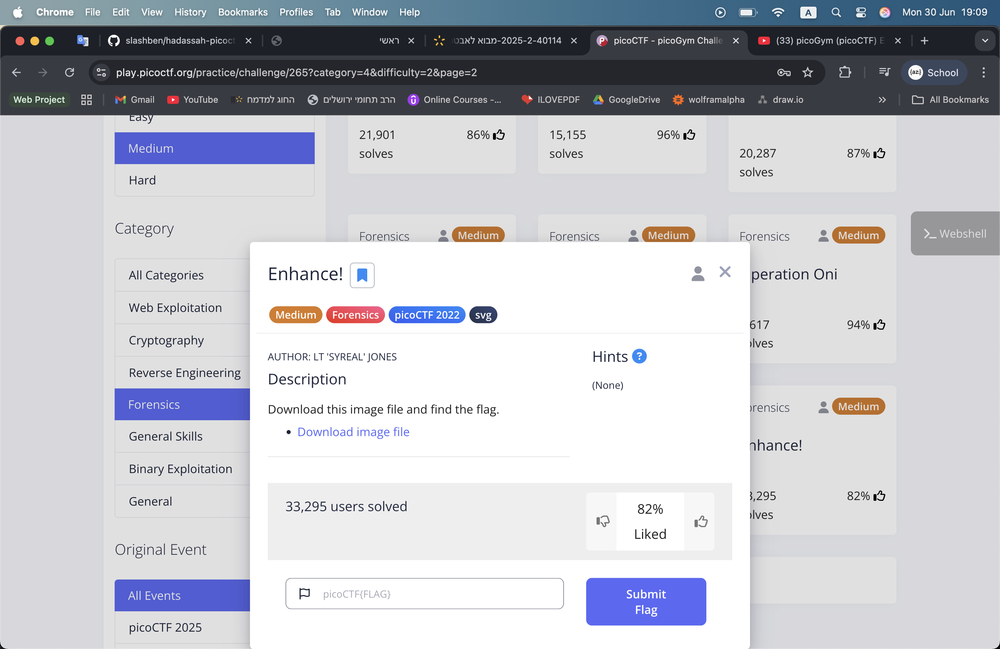
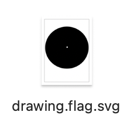
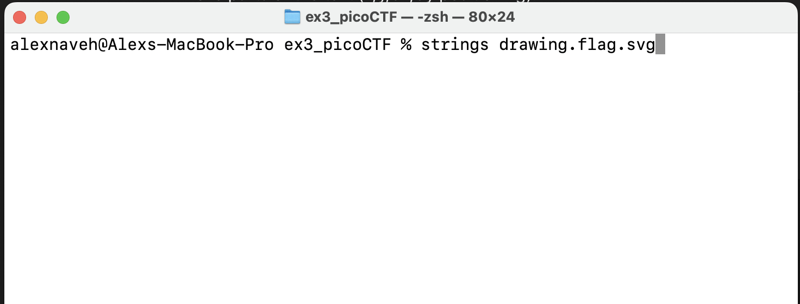
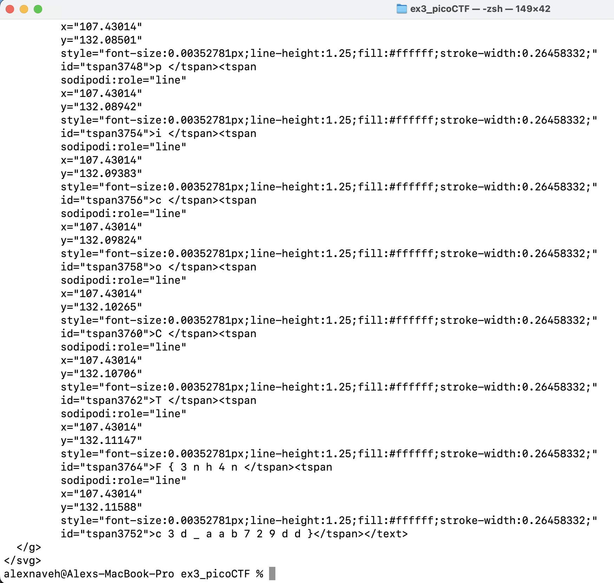
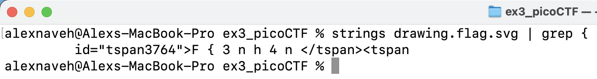
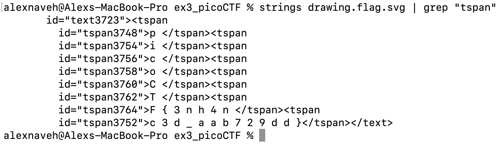
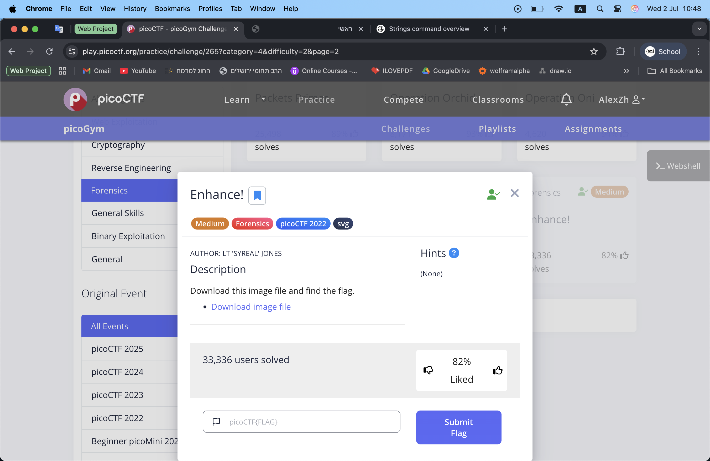

The link of the challenge: [Challenge Link](https://play.picoctf.org/practice/challenge/265?category=4&difficulty=2&page=2)

Go to the link and you should see this:

Click on "Download image file" and download the file **drawing.flag.svg**  

 
thats whats inside:

Open the Terminal and type the command **"strings drawing.flag.svg"**:

The command will show all the readable text from the file:

We cannot really understand and see something unusual from the readable text,  
so lets try to find the "{" symbol for the flag by the command **strings drawing.flag.svg | grep "{"** :

Found something that looks like the middle of the flag text.  
lets find more **tspan** tags by using the command **strings drawing.flag.svg | grep "tspan" :

The flag is found inside the tspan tags!  
enter the flag into the challenge text-box:

:trophy: the challenge is **solved**.  

#### The flag is: picoCTF{3nh4nc3d_aab729dd}
