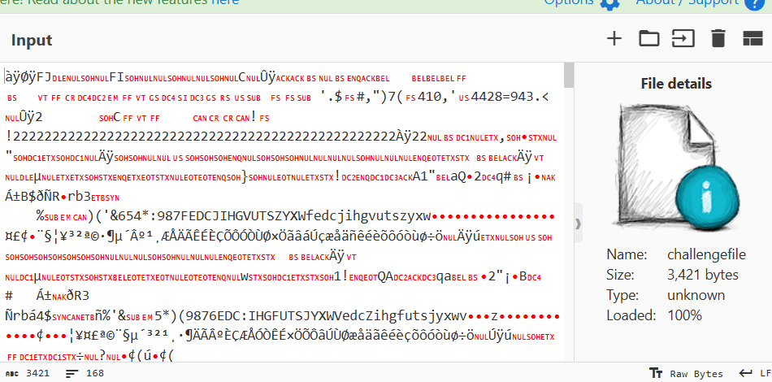
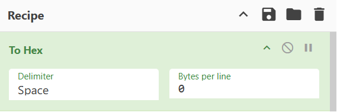
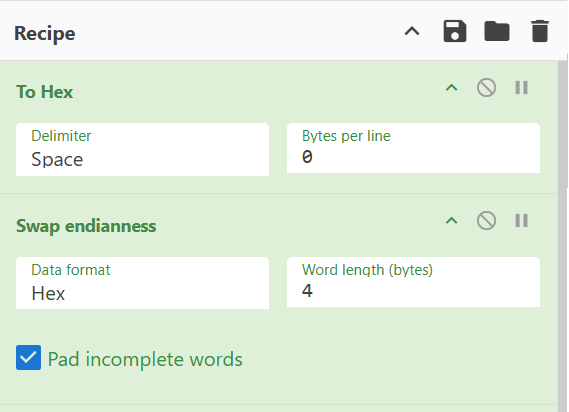
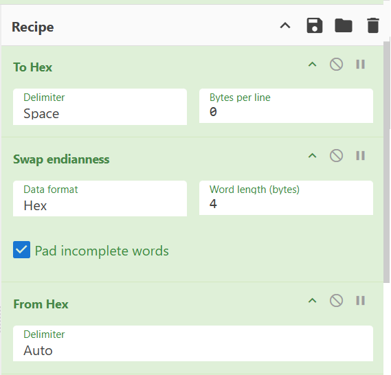
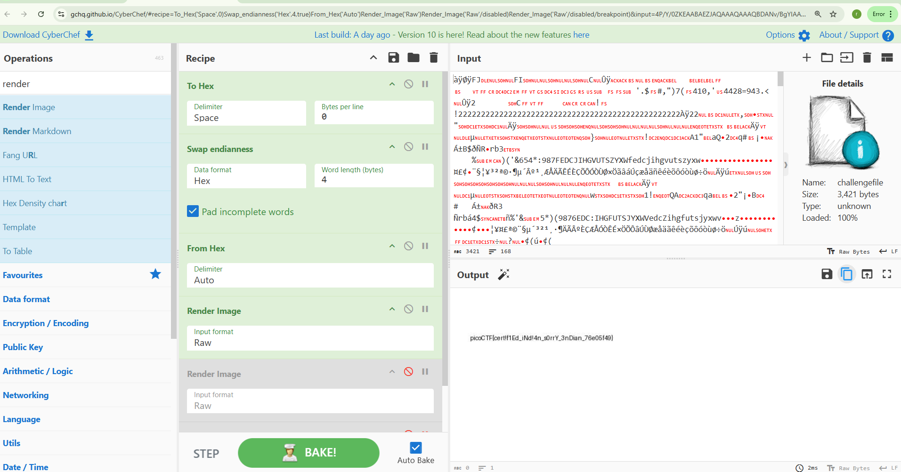
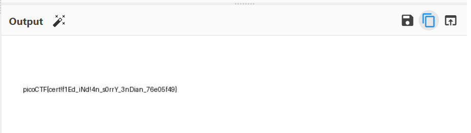

# Challenge: Endianness v2 

# roey yonayov- roey19630

## Challenge Description

We were given a mysterious file named `challengefile`. The title "Endianness v2" hinted at an issue related to byte order. Our goal was to decode the file correctly and retrieve the hidden flag.

---

## Solution Steps (Using CyberChef)

The entire challenge was solved using [CyberChef](https://gchq.github.io/CyberChef), a online tool for analyzing and transforming data.

---

### Step 1: Upload the file

We dragged and dropped the file `challengefile` into the input section of CyberChef.


---

### Step 2: Convert to Hex

We applied the `To Hex` operation to see the raw hex values.

- **Delimiter:** `Space`
- **Bytes per line:** `0`


---

### Step 3: Swap Endianness

Next, we added the `Swap endianness` operation to reverse the byte order.

- **Data format:** `Hex`
- **Word length (bytes):** `4`
- ✔ Checked the option: **Pad incomplete words**


---

### Step 4: Convert From Hex

We added the `From Hex` operation to turn the adjusted hex values back into raw data.


---

### Step 5: Render Image

To visualize the output, we added `Render Image` (Raw format). This revealed the hidden content inside the file.


---

## Final Output
---

---
At the end of the processing chain, CyberChef revealed the following message in the output:

```text
picoCTF{cert!f1Ed_iNd!4n_s0rrY_3nDian_76e05f49}

