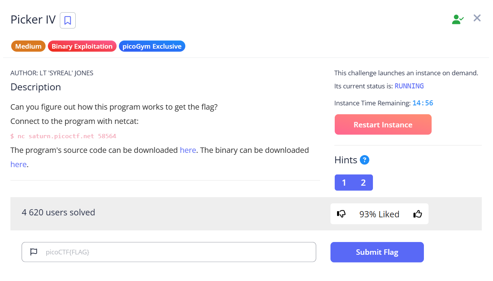
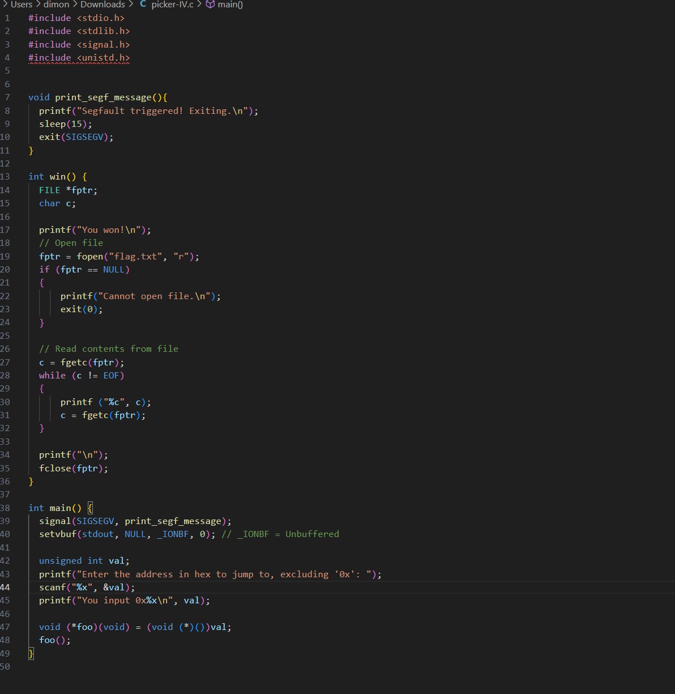
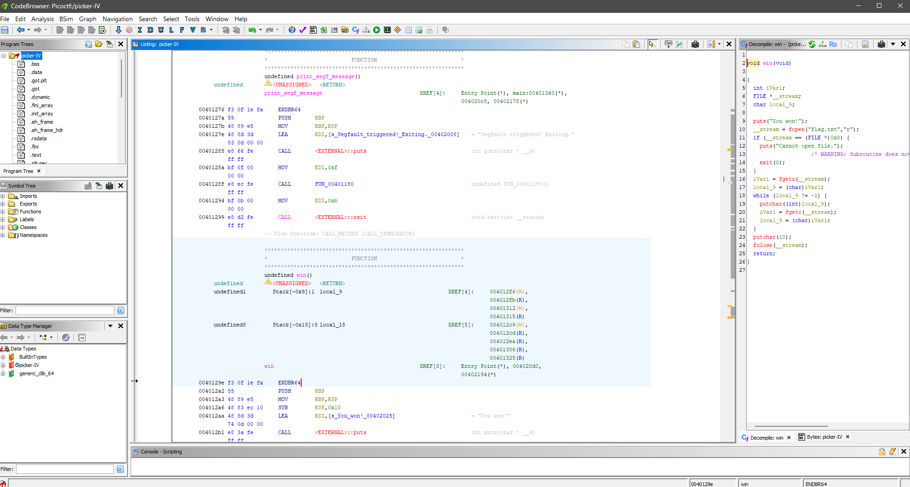
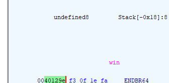
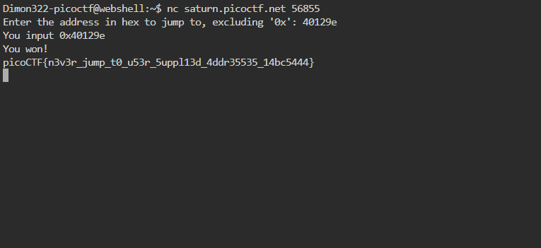

# Picker IV Writeup

## The Challenge

We're given the program's soruce code and a binary file for the code. we will inspect those files and see what we can do.

## Solution

### Step 1

By looking at the source code we can see that the program excepts an input that will be an address in hex. we also can see that there is a "win" method which should give us the key. now we have to find the address for the programm so it will "jump" to the "win" address.

### Step 2

Now we will look into the binary file. we will open it using Ghidra. Then we will look at which address the Win function is stored at.

As we can see the address for "Win" method is stored at 0040129e, we will copy that value into the Challanges instance.

### The Flag

Paste the value of the address we found into the instance of the challenge and we get:

## Congrats challenge is solved

## Why This Works

- **Setuid Privileges:** The binary runs as root, so it can read /root/flag.txt
- **PATH Injection:** By putting our directory first in PATH, we control what md5sum means
- **Command Substitution:** Our symlink makes md5sum execute cat instead
- **System() Behavior:** system() doesn't use absolute paths, allowing our attack

