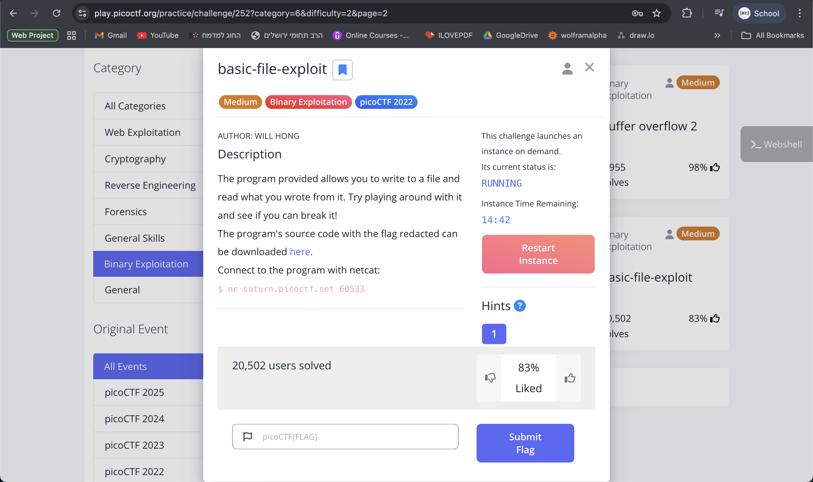
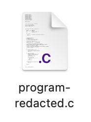
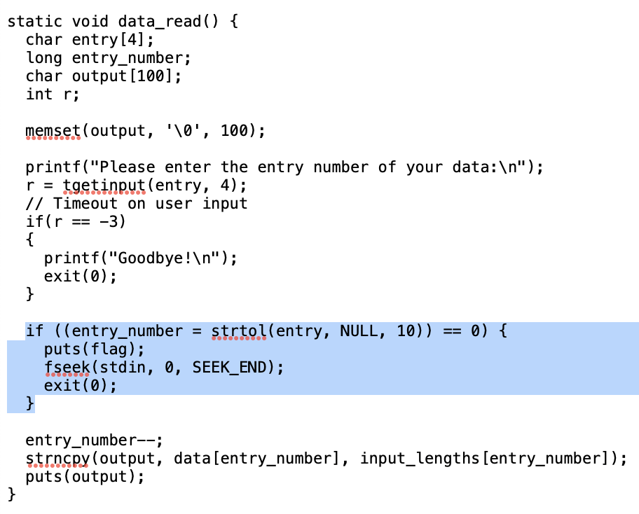
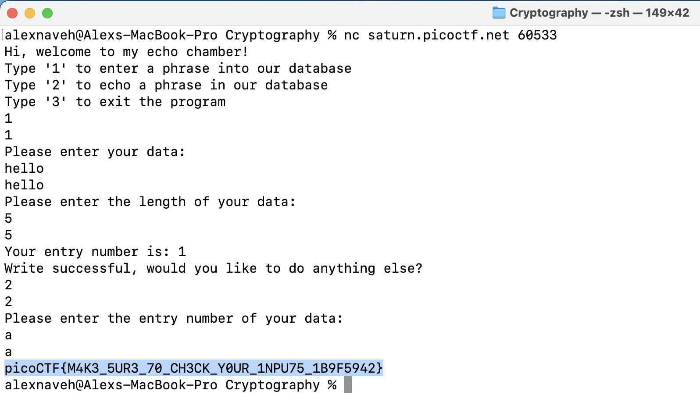
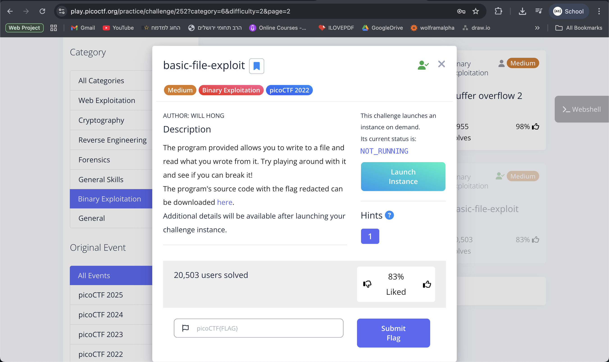

The link of the challenge: [Challenge Link](https://play.picoctf.org/practice/challenge/252?category=6&difficulty=2&page=2)

Go to the link and you should see this:

Click on "here" link and download the file **program-redacted.c**  

 
Open the file and look for the exploit in the code: 
you can see that the flag is outputed in the read_data function 
after you enter a 0 valued input like "a" when it askes for entry number of the data 

Run the given connection code with netcat in the Terminal **nc saturn.picoctf.net <number>**:

the flag is given by the exploit of the program!:

:trophy: the challenge is **solved**.  

#### The flag is: picoCTF{M4K3_5UR3_70_CH3CK_Y0UR_1NPU75_1B9F5942}
