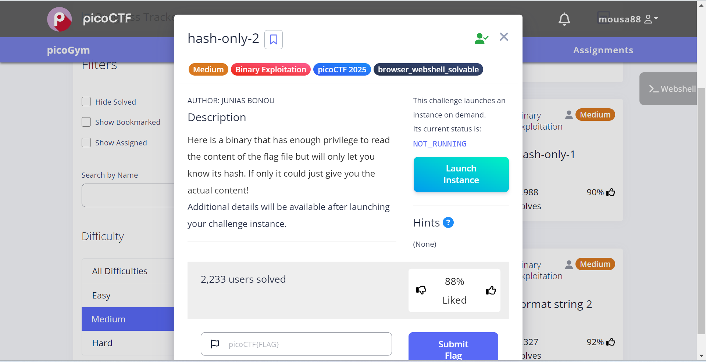

# hash-only-2 Writeup

## The Challenge

We're given a binary called `flaghasher` that can read `/root/flag.txt`, but instead of showing the flag, it only displays its MD5 hash. The challenge is to bypass this restriction and get the actual flag content.

## Description
The binary has setuid root permissions, meaning it runs with root privileges. It uses `system()` to execute `md5sum /root/flag.txt`. Our goal is to intercept this command execution.

## Hints
none

## Initial Investigation
First, we connect to the challenge instance ssh connect

After logging in, we examine the files:

Key observations:
- There's a binary named `flaghasher` 
- The binary is owned by root

When we run the binary normally:

It tries to execute `md5sum` but fails. This reveals it's using `system()` to call the md5sum command.

## The Solution
### Step 1: Understand the Vulnerability
The binary uses `system("md5sum /root/flag.txt")` which:
1. Searches for `md5sum` in directories listed in PATH
2. Executes the first `md5sum` it finds

### Step 2: Create a Fake md5sum
We'll create a symbolic link that makes `md5sum` actually run `cat`:
'''bash'''
ln -s /bin/cat md5sum

### Step 3: Manipulate the PATH

export PATH=".":$PATH

and we get the flag

Instead of running the real md5sum, it:

- Finds our fake md5sum (which is actually cat)
- Executes cat /root/flag.txt
- Displays the flag contents directly

## The Flag

The complete flag is:  
picoCTF{Co-@utH0rOfSy5tem_b!n@riEs_9c5db6a7}

## Why This Works

- **Setuid Privileges:** The binary runs as root, so it can read /root/flag.txt
- **PATH Injection:** By putting our directory first in PATH, we control what md5sum means
- **Command Substitution:** Our symlink makes md5sum execute cat instead
- **System() Behavior:** system() doesn't use absolute paths, allowing our attack

