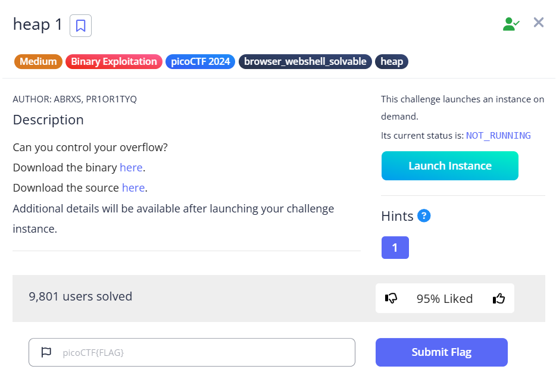

# Heap 1 Challenge Write-up
This is the write-up for the challenge **"heap 1"** from picoCTF 2024.

---

## The Challenge

### Description
Can you control your overflow?
[Challenge link](https://play.picoctf.org/practice/challenge/439?category=6&difficulty=2&page=1)



---

## Initial Look

When you connect to the challenge, you're presented with a menu-driven program:

```
1. Print Heap
2. Write to buffer
3. Print x
4. Print Flag
5. Exit
```

The goal is to manipulate heap memory to change `safe_var` from its default value to "pico" so option 4 will print the flag.

The vulnerability is in option 2 - there's no bounds checking on the input buffer, allowing for heap overflow. Two malloc calls are made in succession, meaning their memory addresses are adjacent in the heap. When you overflow the first buffer, you can overwrite `safe_var`.

---

## How to Solve It

---

### Step 1: Get connection details

* **Go to the challenge page**: [Challenge link](https://play.picoctf.org/practice/challenge/439?category=6&difficulty=2&page=1)
* **Look for connection information**: click the button "Launch Instance"
* **You'll see something like**: `nc tethys.picoctf.net 58894` (example)

---


### Step 2: Update the connection details

Replace `HOST` and `PORT` in `solution.py` with the actual values from the challenge page.

---

### Step 3: Run the solution

Execute the script:
```bash
python solution.py
```

---

### Step 4: Understanding the payload

The payload `"A" * 32 + "pico"` works because:
- The first 32 characters fill the allocated buffer completely
- The additional 4 characters ("pico") overflow into the adjacent memory where `safe_var` is stored
- This overwrites `safe_var` with "pico"

---

### Step 5: Get the flag

The script will automatically:
1. Connect to the challenge
2. Select option 2 (Write to buffer)
3. Send the overflow payload
4. Select option 4 (Print Flag)
5. Display the flag

---

## Final Result

After successfully overflowing the heap and overwriting `safe_var` with "pico", the program prints the flag.

**Flag:** `picoCTF{starting_to_get_the_hang_9e9243f9}`

---

Cheers and happy hacking!