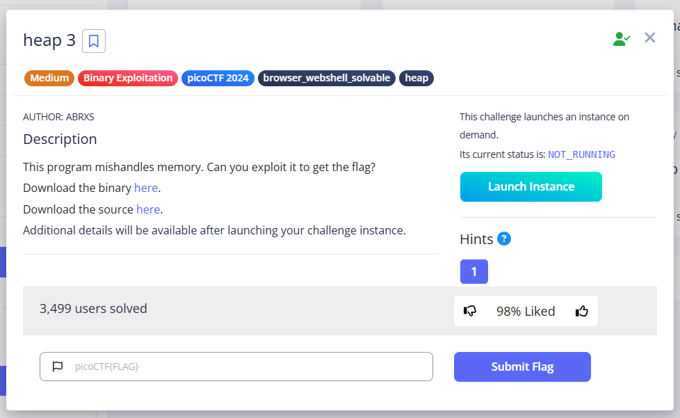
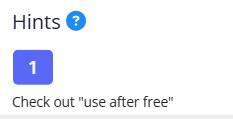
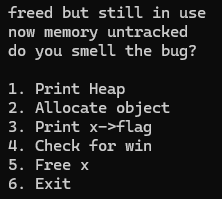
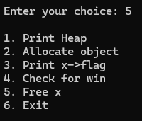
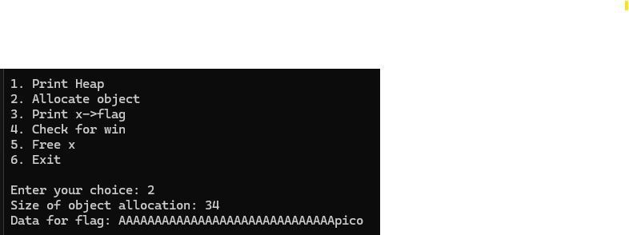
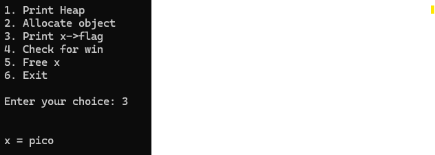
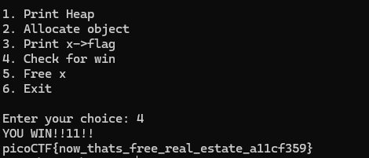

# heap-3 Writeup

## The challenge

The link of the challenge: https://play.picoctf.org/practice/challenge/440?category=6&page=1

Go into the link.

You should see this page: 

  

Clicking the hint will reveal it:

  

## Solution Overview
This challenge involves exploiting a Use-After-Free vulnerability to overwrite a struct field `flag` and trigger the winning condition.

## How to solve it

1) Download the necessary files

2) Check the files locally (optional)
   You can open and review the source code file chall.c with any text editor or IDE.
   To run the binary file (chall), you will need environments such as WSL (Windows Subsystem for Linux) or tools like Git Bash or Cygwin.

3) Connect to the remote server
   To try the challenge online, use netcat to connect to the remote service.
   On Windows, you can do this using WSL or any terminal that supports netcat:
   nc tethys.picoctf.net 49530

  You should see this:
    

  now:
  Step 1: Free x
  Choose option 5 to free the original object:
   
 
 Step 2: Allocate a new object with crafted input
 Select option 2, then:

 Enter 34 as the size (30 A's + "pico" = 34)
  

 
 Step 3: Verify overwrite
 Select option 3 to print x->flag:
 If successful, you’ll see "pico" — this means we successfully overwrote the flag field
 

 Step 4: Trigger the win
 Select option 4:
 You should see this:
 

 the challenge is solved.

 The flag is: picoCTF{now_thats_free_real_estate_a11cf359}
