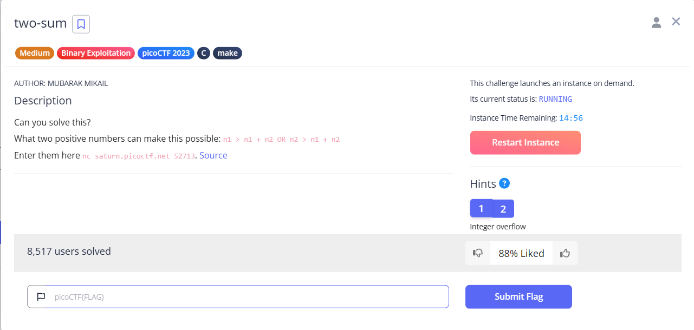
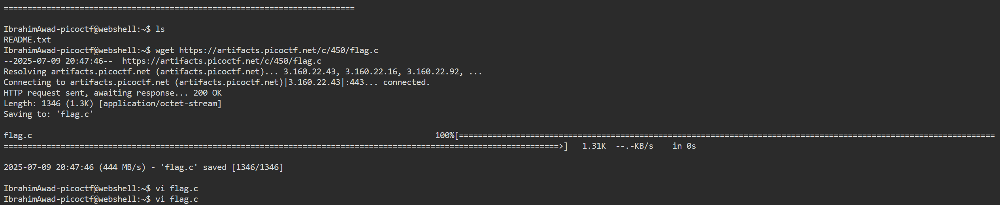
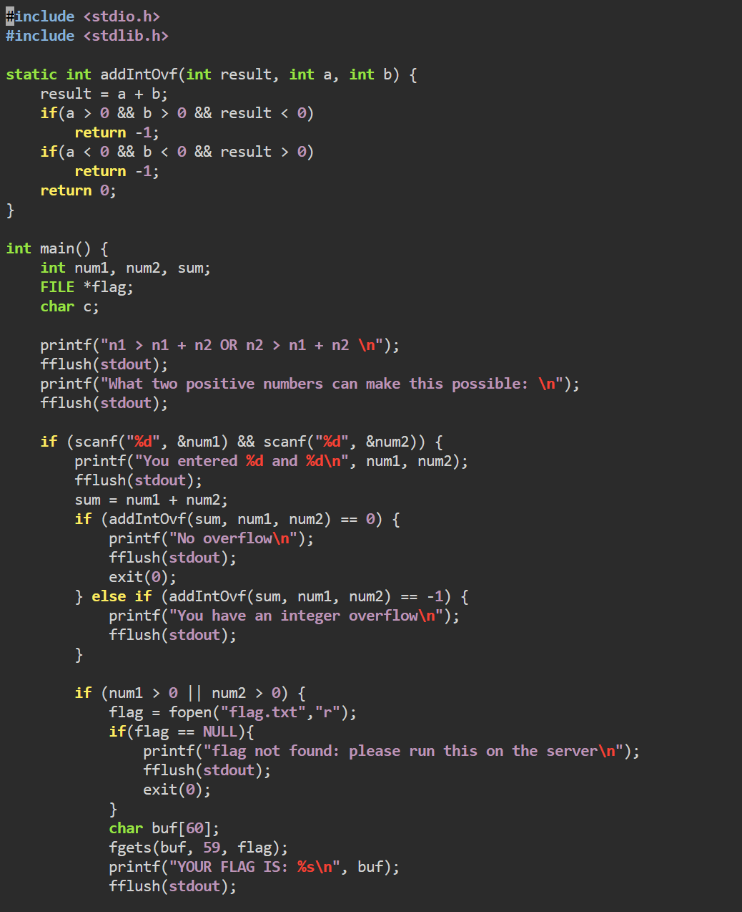
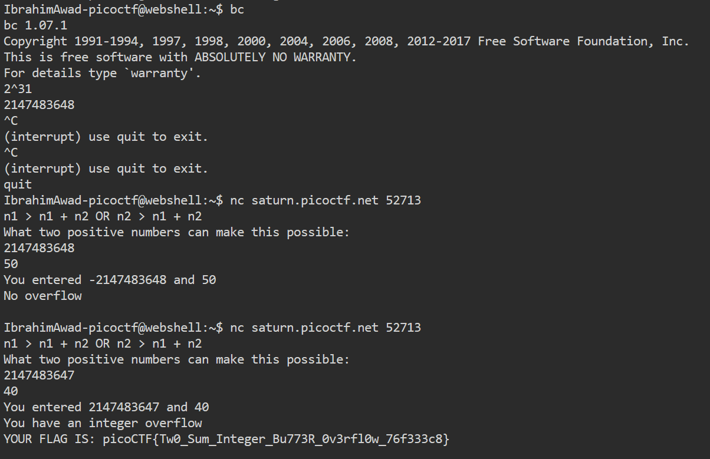

# two-sum

This is the write-up for the **"two-sum"** challenge from picoCTF 2023.

---

# The challenge

## Description

Can you solve this?
What two positive numbers can make this possible: n1 > n1 + n2 OR n2 > n1 + n2
Enter them here nc saturn.picoctf.net 54899. Source

---

## Initial look



After clicking **"Launch Instance"** on the picoCTF challenge page, I discovered the challenge runs on a remote shell at:

```
http://webshell.picoctf.org/
```

I connected and used `wget` to download the provided source file `flag.c`:



---

## Understanding the code

The C code defines a function that checks for **signed integer overflow** when adding two integers. If overflow is detected, the program prints a message and proceeds to show the flag. Otherwise, it exits early.

To trigger the flag, we need to provide **two positive integers** that cause an overflow in 32-bit signed addition.



---

## How I solved it

I calculated `2^31 = 2147483648` using `bc` to identify the overflow boundary.

Then, I used `nc` to connect to the challenge server and experimented with values:

- `2147483648` + `50` → no overflow.
- `2147483647` + `40` → triggers overflow → reveals the flag!



---

## The flag

```
picoCTF{Tw0_Sum_Integer_Bu773R_0v3rfl0w_76f333c8}
```

---

## Done!
