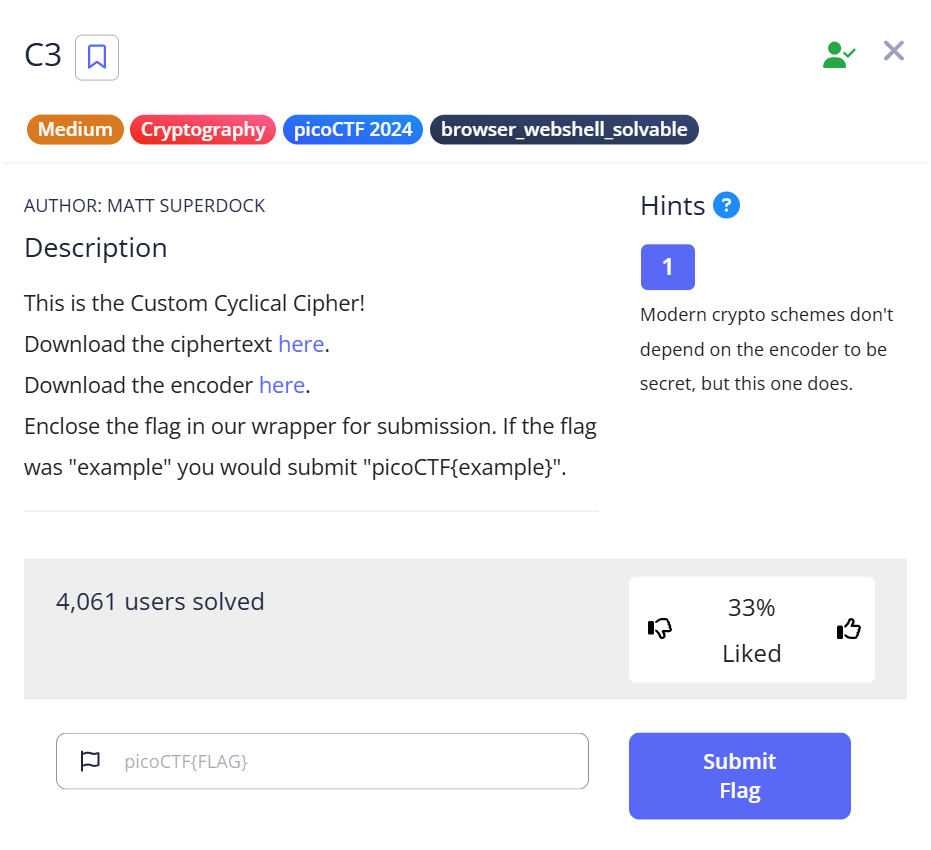

# C3 Challenge Write-up

This is the write-up for the challenge **"C3"** from picoCTF 2024.

---

## The Challenge

### Description

The flag has been encrypted using a custom substitution cipher. Can you decrypt it?

[Challenge link](https://play.picoctf.org/practice/challenge/407?category=2&difficulty=2&page=1)



---

## Initial Look

The challenge provides a file named `ciphertext` containing a long string of seemingly random uppercase and lowercase letters.

By inspecting the file, we see characters mostly from the sets:

```
ABCDEFGHIJKLMNOPQRSTUVWXYZ
abcdefghijklmnopqrstuvwxyz
```

Additionally, the challenge provides a Python script (`convert.py`) that hints at the encryption scheme. The script uses two lookup strings:

```python
lookup1 = "\n \"#()*+/1:=[]abcdefghijklmnopqrstuvwxyz"
lookup2 = "ABCDEFGHIJKLMNOPQRSTabcdefghijklmnopqrst"
```

The ciphertext seems to be composed of characters from `lookup2`, indicating it is an encoded message.

The goal is to reverse the encoding by mapping characters from the ciphertext back into `lookup1`, as shown in the script.

Once decrypted, the output appears to be another Python script that reads input and prints characters at positions corresponding to cube numbers (1, 8, 27, 64, ...).

This suggests a two-step challenge:

1. Use the lookup tables to decode the ciphertext into a Python script.
2. Run the decoded Python script on the ciphertext or another input to extract the flag.

---

## How to Solve It

---

### Step 1: Use the provided decrypt.py script

Make sure the file decrypt.py is in the same directory as the ciphertext file.

---

### Step 2: Run the decrypt script

Run this command to decrypt the ciphertext:

```bash
cat ciphertext | python3 decrypt.py > decrypted.txt
```

---

### Step 3: The decrypted.txt file contains:

```
#asciiorder
#fortychars
#selfinput
#pythontwo

chars = ""
from fileinput import input
for line in input():
    chars += line
b = 1 / 1

for i in range(len(chars)):
    if i == b * b * b:
        print chars[i] #prints
        b += 1 / 1
```

---

### Step 4: Make a `decrypted_fix.py` file

Copy the contents of `decrypted.txt` and paste it into `decrypted_fix.py`, with this changes:

```
#asciiorder
#fortychars
#selfinput
#pythontwo

chars = ""
from fileinput import input
for line in input():
    chars += line
b = 1 / 1

for i in range(len(chars)):
    if i == b * b * b:
        print (chars[i], end = '') #prints
        b += 1 / 1
print()
```


---

### Step 5: Run the fixed decrypted script

Run this command:

```bash
cat decrypted.txt | python decrypted_fix.py > stage.txt
```

---

### Step 6: Find the flag

The flag will be inside the `stage.txt` file:

```
adlibs
```

---

## Final Result

After decoding, we get the flag 

**Flag:** `picoCTF{adlibs}`

---

Cheers and happy hacking! 

