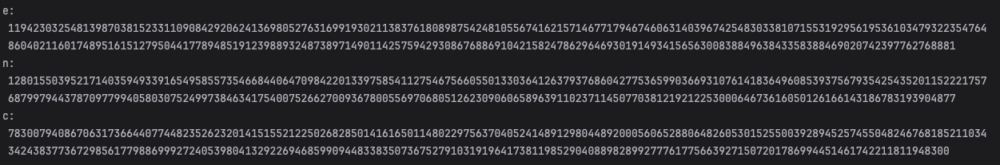
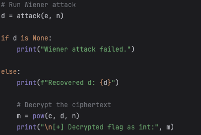
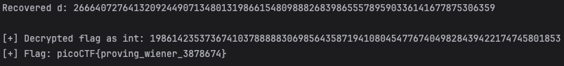

# Dachshund Attacks
This is the write-up for the challenge "Dachshund Attacks" challenge in PicoCTF

# The Challenge
## Description
What if d is too small?
## Hints
What do you think about my pet? dachshund.jpg

## Initial look
We start by connecting to the server:
 
We can see that this is RSA, well save the data the server has given us.

```
e: 39485145008650107911557888606716405001939520288398991002987307991557688968496516433368907277880327342138878639003095640452483557565748039552256409417988083459906607958884676489964385432551984664437905119603760835507638049083161271225154859909638767286398067700006526284458326297386681514810075177508719700039
n: 112751716575052797252462402773735527190510089797451503244556784491319457769107078165570925380290065476740819142717486846746000855348017094076907501987908459309438625722536509640668695393497357073641708668559158929842361922505124601033729644931445527797992117186341766936280129560565669801540583202212112145831
c: 58145194552282049953548719750365168635632383487574838595844751612816001705064632965712874605006547556127495708006313201394017878101797756012007636257682241494864713784724000378103415081002406495964926956538769637170309776169654468026220316606934643377033565516047343051478330971734325463877538260785531950457
```

# How to solve it
Dachshund are also called wiener dogs, the name is a reference to **wiener attacks** on RSA.

There is a wiener attack implementation on python called [oWiener](https://pypi.org/project/owiener/).
We will use this to solve for d.
 

Success! We found our flag.

 
# 🎉 Flag
> **picoCTF{proving_wiener_3878674}**
