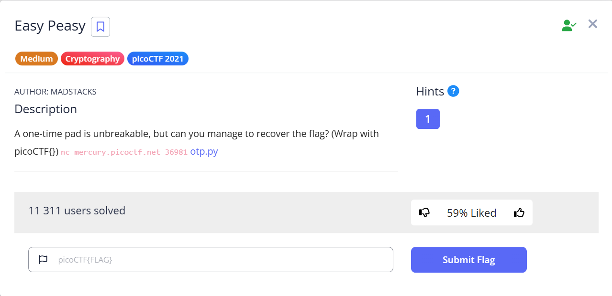
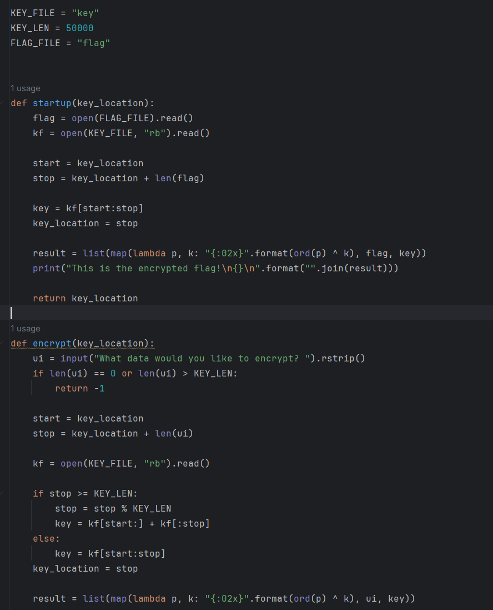
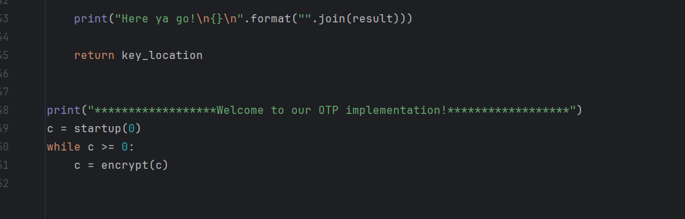
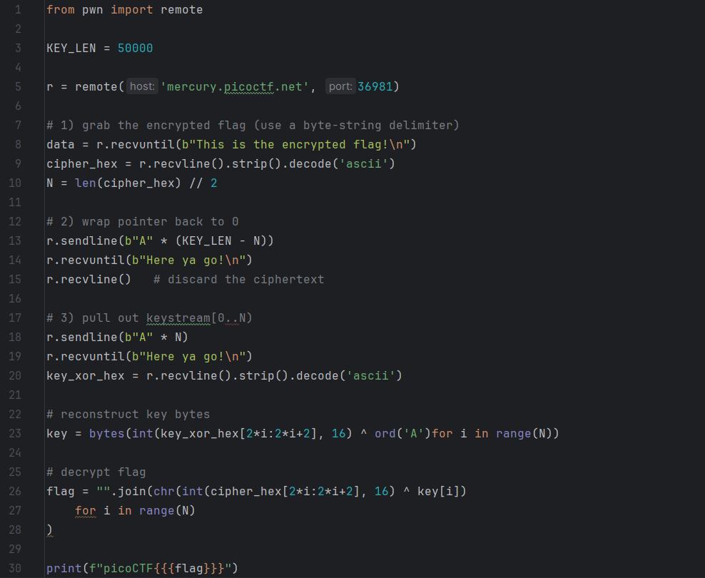
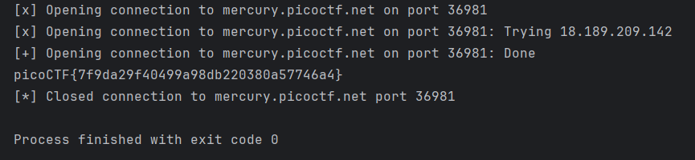

# easy-peasy (OTP) challenge

This repository contains the write-up for the Easy Peasy one‑time pad challenge from picoCTF 2021Link for the challenge: https://play.picoctf.org/practice/challenge/476

## Description

A server implements a naive one‑time pad: it uses a large key file to encrypt the flag, but then continues using the same pad for user-supplied plaintext. By interacting with the service, we can recover the pad bytes and decrypt the flag.

Solution steps

1. View the prompt

Open the challenge and observe the description and connection details:

2. Explore the provided code

The challenge supplies otp.py (the encryption service). We studied its logic:

startup(key_location) encrypts and prints the flag using the pad slice at key_location → advances the pointer.

encrypt(key_location) reads user input, XORs it with the pad at the current pointer, returns ciphertext and advances the pointer.

3. Launch our attack

We write OTPattack.py (provided in scripts folder) to:

Connect to the remote service.

Retrieve the encrypted flag.

Send dummy bytes ("A" * (KEY_LEN – flag_len)) to wrap the pad-pointer to 0.

Send another sequence of "A" bytes of length = flag_len to XOR the keystream directly.

Reconstruct the raw pad by XORing the keystream hex with 'A'.

XOR the pad bytes with the original flag ciphertext to recover the plaintext flag.

4. Run the attack

Execute otpAttack.py. It prints the recovered flag in the picoCTF format:

5. Confirmation

Upon submission, the platform shows success:

Challenge solution key:

picoCTF{7f9da29f40499a98db220380a57746a4}

Easy Peasy challenge is solved, great work!
