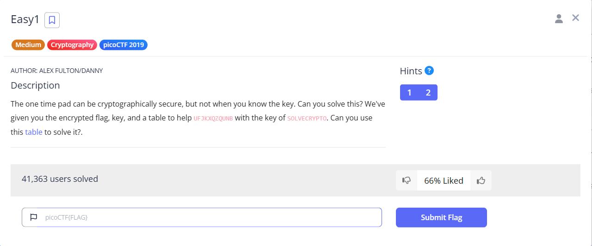
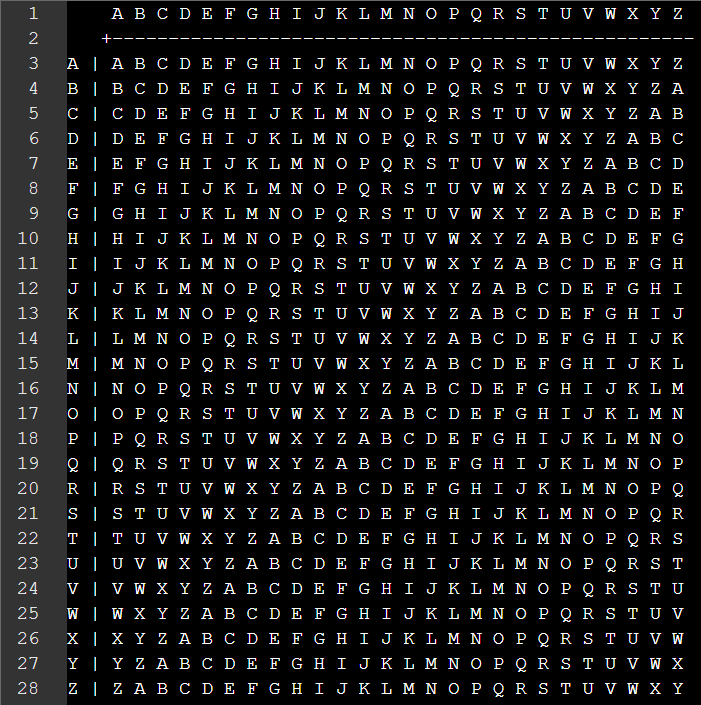
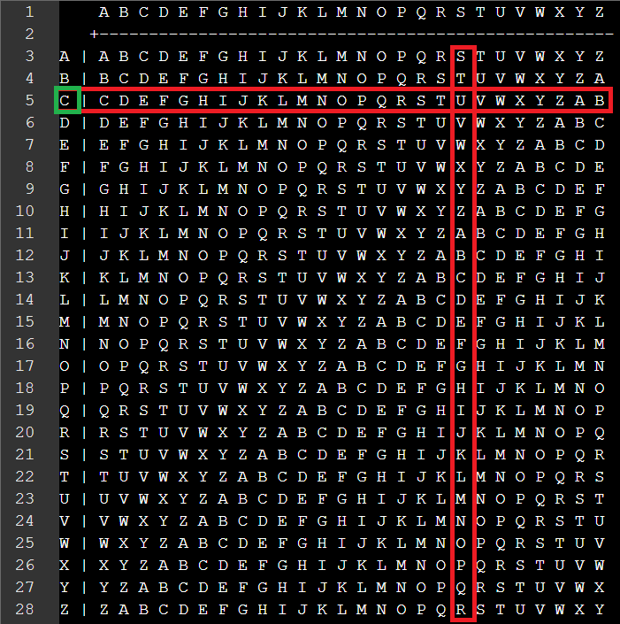

# Easy1

This is the write-up for the "Easy1" challenge from picoCTF.

---

# The challenge

## Description

The one time pad can be cryptographically secure, but not when you know the key. Can you solve this? We've given you the encrypted flag, key, and a table to help UFJKXQZQUNB with the key of SOLVECRYPTO. Can you use this table to solve it?.



---

## Initial look

When you open the table, you'll see a text file with the English alphabet arranged in rows and columns. Each row is a shifted version of the alphabet, which will help in decrypting the message.



---

# How to solve it

To decrypt the message, I started by looking at the intersection of the ciphertext and the key in the table. For example:

The first letter of the ciphertext is U, and the first letter of the key is S. The intersection of U and S gave me M, I continued this process for the rest of the letters, getting the flag picoCTF{MTUFBSQOJGP}.

However, this was incorrect. I later realized I needed to adjust my method and focus on the correct intersections to get the right flag.

Here’s the correct way to solve it:

- What with an S gives me a U → C

- What with an O gives me an F → R
- What with an L gives me a J → Y
- What with an V gives me a K → P
- What with an E gives me an X → T
- What with a C gives me a Q → O
- What with an R gives me a Z → I
- What with a P gives me a Q → S
- What with a T gives me a U → F
- What with an O gives me an N → U
- What with an R gives me a B → N

Following this pattern, I got the correct flag.

---

## The flag

```
picoCTF{CRYPTOISFUN}
```
Done!