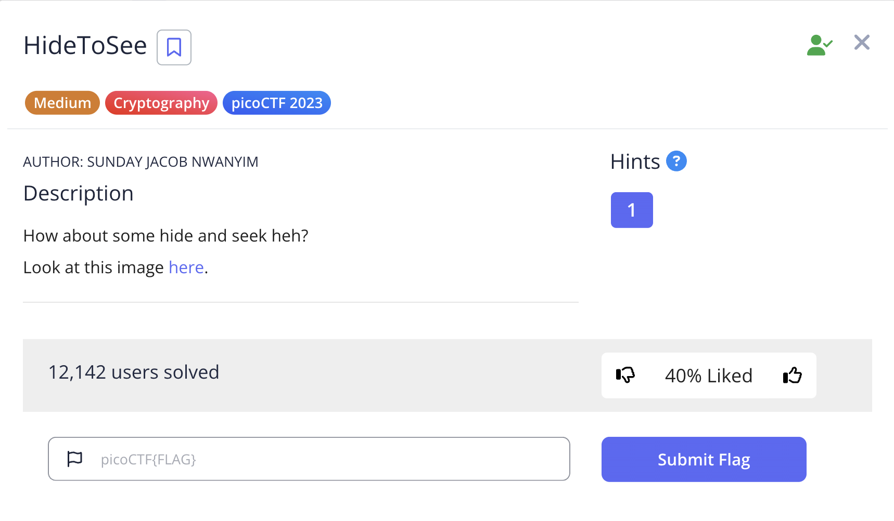

# HideToSee

This is the write-up for the challenge "HideToSee" from PicoCTF 2023 cryptography.

# The challenge

## Description
How about some hide and seek heh?
Look at this image [here.](https://artifacts.picoctf.net/c/240/atbash.jpg)



## Hint
Download the image and try to extract it.

## Initial look
The challenge provides an image of an Atbash Cipher wheel, which suggests that steganography and the Atbash cipher will both be involved in solving this challenge.


# How to solve it

## Step 1: Extract hidden data from the image
Since the hint mentions extracting data from the image, this is clearly a steganography challenge. I used an online steganography decoder to extract hidden content from the image.
I uploaded the image to https://futureboy.us/stegano/decinput.html 
which revealed hidden text:

`krxlXGU{zgyzhs_xizxp_xz00558y}`


## Step 2: Apply Atbash cipher decryption
The extracted text appears to be encrypted with an Atbash cipher (as hinted by the image content). The Atbash cipher is a simple substitution cipher where each letter is replaced by its mirror position in the alphabet (A<->Z, B<->Y, C<->X, etc.).
I wrote a Python script to decrypt the Atbash cipher:
```bash
def atbash(text):
    result = ""
    for c in text:
        if c.isalpha():
            if c.isupper():
                result += chr(155 - ord(c))  
            else:
                result += chr(219 - ord(c))  
        else:
            result += c
    return result

cipher = "krxlXGU{zgyzhs_xizxp_xz00558y}"
print(atbash(cipher))
```

# Solution
Running the decryption script gives us the flag:

`picoCTF{atbash_crack_ca00558b}`

Voila!!! 😎
Cheers 😄