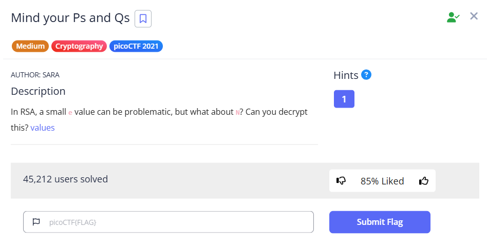
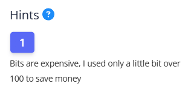
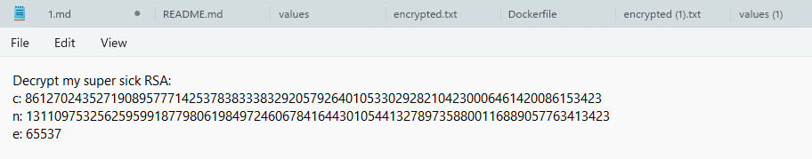
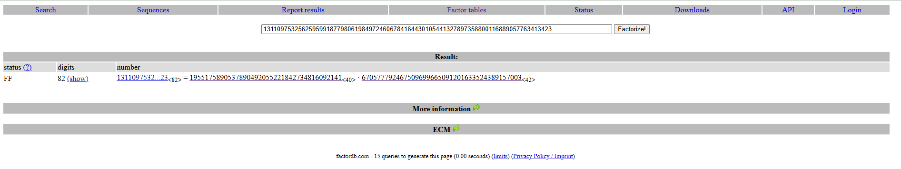
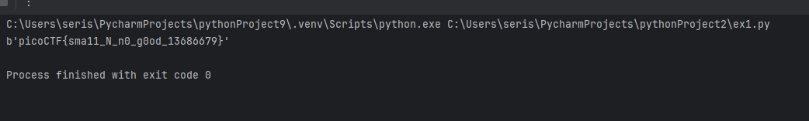

# Mind your Ps and Qs
These are the steps to solve the Mind your Ps and Qs hint.

## The challenge

# description
The link of the challenge: https://play.picoctf.org/practice/challenge/162?category=2&difficulty=2&page=2

Go into the link.

You should see this page: 

  

Clicking the hint will reveal it:

  

Click the link to receive an encrypted text file
You should see this: 

 

## How to solve it
Based on the description and the known cipher, we can conclude that this is RSA encryption.

In the RSA encryption system:
C – The ciphertext that needs to be decrypted.
N – The product of two prime numbers, p and q: N = p*q
Phi – Euler's totient function of N: ?=(p?1)*(q?1)
d – The private key.
E – The multiplicative inverse of d modulo phi:(mod ?)1 ? d*E

now we need to find p and q.

The hint "Bits are expensive, I used only a little bit over 100 to save money" indicates that the number n is
relatively small (just over 100 bits). This means factoring it into prime factors is achievable using automated
tools, which is why we used the FactorDB website. Since the number is relatively small, it can be quickly
factored to find the prime factors p and q This allows us to compute the private key and decrypt the message.
Therefore, we will input N into the FactorDB website to obtain p and q.

Now we will write some code to calculate the private key (d) and decrypt the message:

the challenge is solved.

The flag is: picoCTF{sma11_N_n0_g0od_13686679}