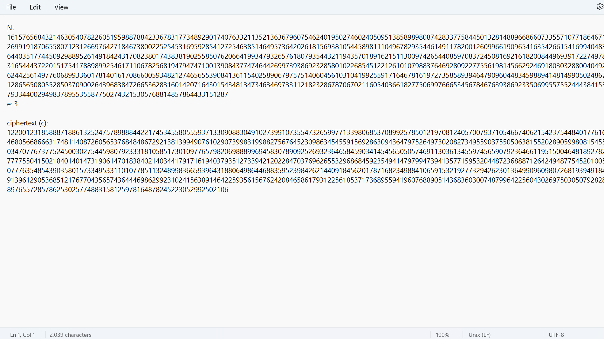
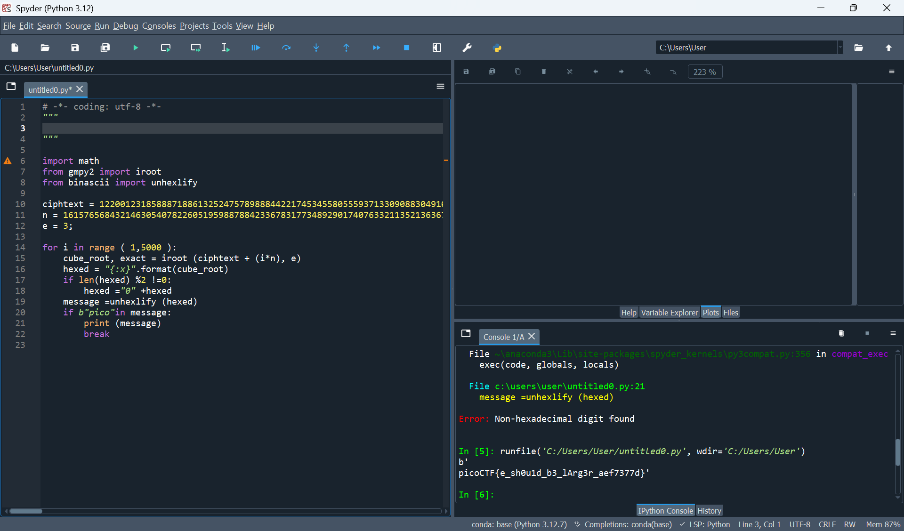

# Mini RSA

The link for the challenge: 
 
Start the challenge 

We get a text file

 

Based on the name of the challange we assume a RSA cipher.

## RSA cipher:

C = m^e mod N

Decryption:
M=e√(iN+C)  i = change number 

So i used a py code to run on all the possibilities (script attached)
and we get:

after Decryption the text , we will get a readable text after subtract the key from the cipher letter.

picoCTF flags usually start with picoCTF, combine 2 parts {} and we done!

The flag is: picoCTF{e_sh0u1d_b3_lArg3r_aef7377d}
