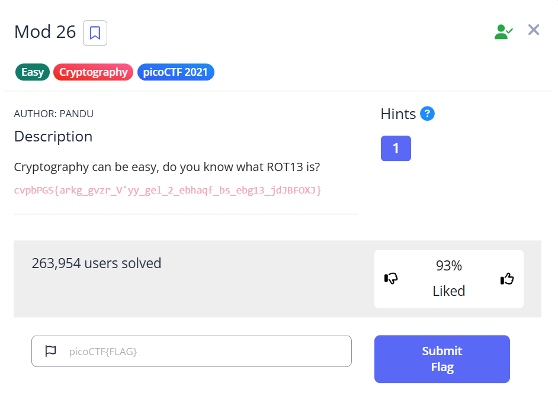

# Mod 26 - picoCTF Challenge



## Solution

The challenge gives us a ROT13-encrypted string. ROT13 is a Caesar cipher that shifts each letter by 13 positions in the alphabet...

(המשך כמו קודם)
# Mod 26

This is the write-up for the challenge **"Mod 26"** from picoCTF 2021.

## 🧩 The Challenge

### Description
Cryptography can be easy, do you know what ROT13 is?


## 🧠 Hints
There is one hint:
> "do you know what ROT13 is?"

Which clearly points us toward the ROT13 cipher.

---

## 🔍 First Look

We are given a string that looks like an encrypted flag:

```
cvpbPGS{arkg_gvzr_V'yy_gel_2_ebhaqf_bs_ebg13_jdJBFOXJ}
```

The name "Mod 26" suggests that this has something to do with shifting letters around in the alphabet — i.e., a Caesar cipher. And since the hint mentions **ROT13**, that confirms it.

---

## 🔓 How I Solved It

I know that ROT13 is a simple letter substitution cipher which replaces each letter with the letter 13 positions after it in the alphabet. Since the English alphabet has 26 letters, applying ROT13 twice gives you the original text.

So I used Python's built-in `codecs` module to decode the string:

```python
import codecs

encrypted = "cvpbPGS{arkg_gvzr_V'yy_gel_2_ebhaqf_bs_ebg13_jdJBFOXJ}"
decrypted = codecs.decode(encrypted, 'rot_13')
print(decrypted)
```

This outputs:

```
picoCTF{next_time_I'll_try_2_rounds_of_rot13_wqWOSBKC}
```

---

## 🏁 The Flag

```
picoCTF{next_time_I'll_try_2_rounds_of_rot13_wqWOSBKC}
```

Cheers 😄
