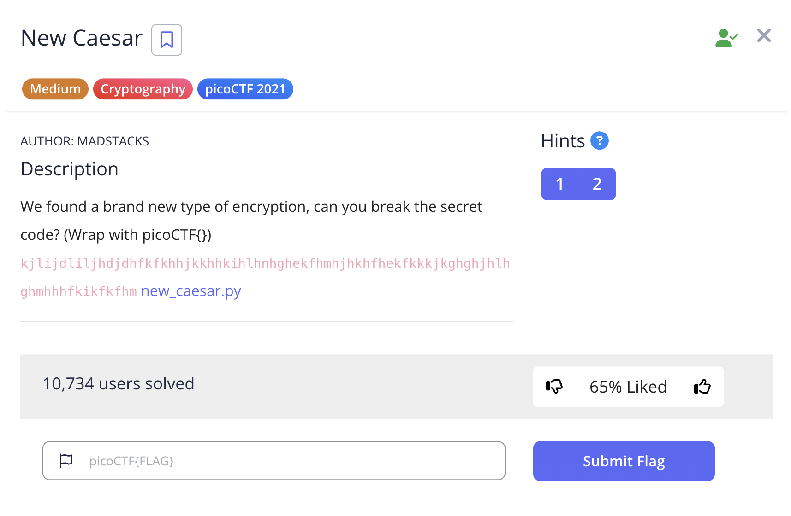

# New Caesar 

This is the write-up for the challenge "New Caesar" from PicoCTF 2021 cryptography.

# The challenge

## Description
We found a brand new type of encryption, can you break the secret code? (Wrap with picoCTF{}) kjlijdliljhdjdhfkfkhhjkkhhkihlhnhghekfhmhjhkhfhekfkkkjkghghjhlhghmhhhfkikfkfhm [new_caesar.py](https://mercury.picoctf.net/static/d9c139d91d2dfec8fd197ca6d970381a/new_caesar.py)



## Hints
1. How does the cipher work if the alphabet isn't 26 letters?
2. Even though the letters are split up, the same paradigms still apply

## Given code (new_caesar.py):
```bash
import string

LOWERCASE_OFFSET = ord("a")
ALPHABET = string.ascii_lowercase[:16]

def b16_encode(plain):
    enc = ""
    for c in plain:
        binary = "{0:08b}".format(ord(c))
        enc += ALPHABET[int(binary[:4], 2)]
        enc += ALPHABET[int(binary[4:], 2)]
    return enc

def shift(c, k):
    t1 = ord(c) - LOWERCASE_OFFSET
    t2 = ord(k) - LOWERCASE_OFFSET
    return ALPHABET[(t1 + t2) % len(ALPHABET)]

flag = "redacted"
key = "redacted"
assert all([k in ALPHABET for k in key])
assert len(key) == 1

b16 = b16_encode(flag)
enc = ""
for i, c in enumerate(b16):
    enc += shift(c, key[i % len(key)])
print(enc)
```

## Initial look
Looking at the encryption process I can see it involves two steps:

1. b16_encode: Converts each character to 8-bit binary, then maps each 4-bit nibble to a character from the 16-letter alphabet (abcdefghijklmnop)
2. shift: Applies a Caesar cipher shift to each character using a single-character key

Since the key length is 1 (as shown by assert len(key) == 1), I need to try all 16 possible keys.

# How to solve it

To decrypt the message, I need to reverse both operations:

1. Reverse the shift cipher for each possible key
2. Reverse the b16 encoding to get the original text

## Step 1: Reverse the shift function
```bash
def reverse_shift(c, k):
    t1 = ord(c) - LOWERCASE_OFFSET
    t2 = ord(k) - LOWERCASE_OFFSET
    return ALPHABET[(t1 - t2) % len(ALPHABET)]
```

## Step 2: Reverse the b16 encoding
```bash
def b16_decode(encoded):
    plain = ""
    for i in range(0, len(encoded), 2):
        if i + 1 < len(encoded):
            high_nibble = ALPHABET.index(encoded[i])
            low_nibble = ALPHABET.index(encoded[i + 1])
            byte_value = (high_nibble << 4) | low_nibble
            plain += chr(byte_value)
    return plain
```

## Step 3: Try all possible keys
Since there are only 16 possible single-character keys, I can brute force them all:
pythonciphertext = "kjlijdliljhdjdhfkfkhhjkkhhkihlhnhghekfhmhjhkhfhekfkkkjkghghjhlhghmhhhfkikfkfhm"

```bash
for key_char in ALPHABET:
    # Reverse the shift cipher
    b16_decoded = ""
    for c in ciphertext:
        b16_decoded += reverse_shift(c, key_char)
    
    # Reverse the b16 encoding
    try:
        flag_candidate = b16_decode(b16_decoded)
        if flag_candidate.isprintable():
            print(f"Key '{key_char}': {flag_candidate}")
    except:
        continue
```

# Solution
Running the decryption with key 'e' gives us:

Decrypted text: et_tu?_1ac5f3d7920a85610afeb2572831daa8

The flag is `picoCTF{et_tu?_1ac5f3d7920a85610afeb2572831daa8}`

Voila!!! 😎
Cheers 😄