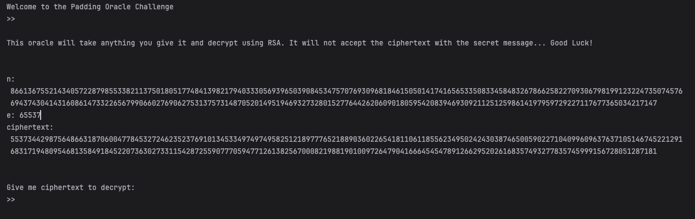
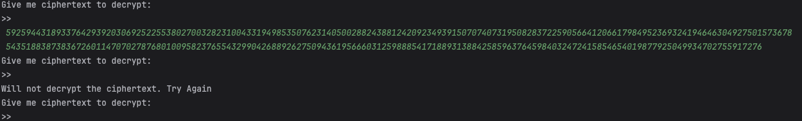
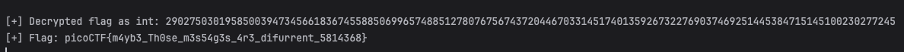

# No Padding, No Problem
This is the write-up for the challenge "No Padding, No Problem" challenge in PicoCTF

# The Challenge
## Description
Oracles can be your best friend, they will decrypt anything, except the flag's ciphertext. How will you break it?

## Hints
What can you do with a different pair of ciphertext and plaintext? What if it is not so different after all...

## Initial look
We start by connecting to the server:
 
Seems like RSA.
Looks like we can decrypt any cyphertext, except the provided one (flag).
 
This is a chosen cipher attack.

# How to solve it
We can choose a ciphertext for the oracle to decypher.

unpadded RSA has the property:
> Enc(m1) * Enc(m2) = Enc(m1 * m2)

Let c0 be the provided cypher, and for a small number of our choosing, we'll choose 2.

we will make the message:

> c = (c0 * 2^e) mod n

So that after decrypting it we will get m * 2.

By dividing the decypted value we got back by 2, we found the flag.

 

# 🎉 Flag

> **picoCTF{m4yb3_Th0se_m3s54g3s_4r3_difurrent_5814368}**
