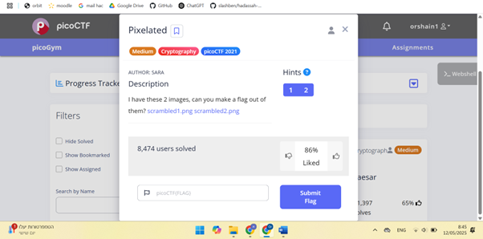
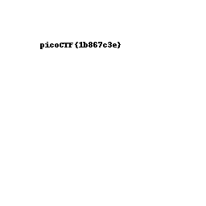

# Pixelated 
This is the write-up for the challenge "Pixelated" in PicoCTF

# The challenge
## description
The link of the challenge: https://play.picoctf.org/practice/challenge/100?category=2&difficulty=2&page=3

Go into the link.

You should see this page:

 
 
Download the images. <br>
    
 

## How to solve it
Write Python code that reads the image pixels and sums the corresponding pixels from both images.

The code:
```python
import numpy as np
from PIL import Image

# Open the images
image1 = Image.open(r"C:\Users\orsha\Downloads\scrambled1.png")
image2 = Image.open(r"C:\Users\orsha\Downloads\scrambled2.png")

# Convert to Numpy arrays
iamge1np = np.array(image1)
iamge2np = np.array(image2)

# Perform pixel-wise addition between the images
result = iamge2np + iamge1np

# Convert back to PIL image and save
Image.fromarray(result).save('resultImage.png')
```

The result is: <br>
 
 
The challenge is solved.

The flag is: picoCTF{1b867c3e}


