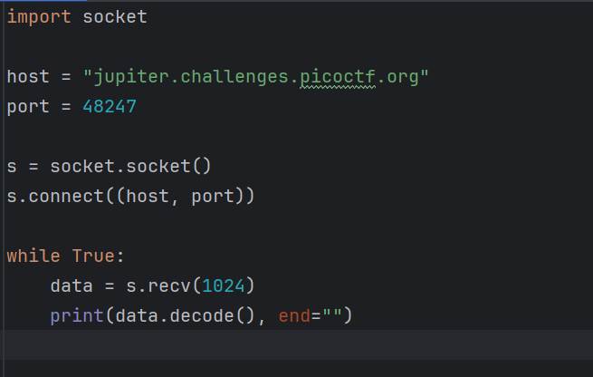
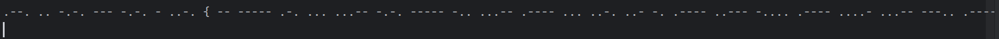
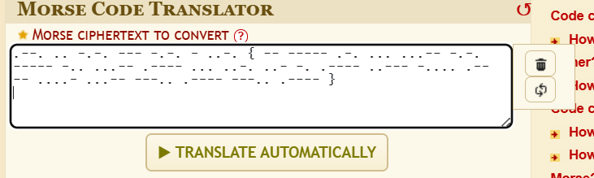
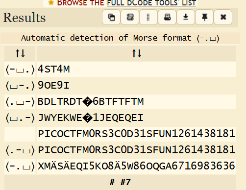
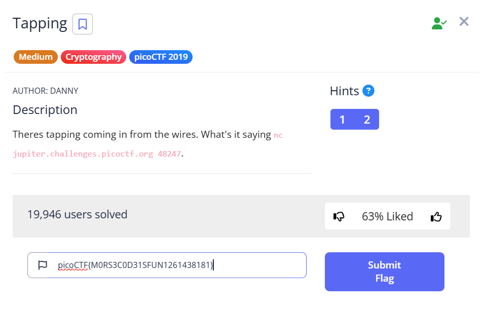

#  picoCTF 2019 - Tapping Challenge

##  Challenge Description

**Category:** Cryptography  
**Difficulty:** Medium  
**Name:** Tapping  
**Author:** Danny

> There's tapping coming in from the wires. What's it saying?

**Server:** `jupiter.challenges.picoctf.org 48247`

---

##  Requirements Before Starting

- You need Python installed on your system.
- Internet connection is required to connect to the remote server.
- Morse code decoding will be needed — use: (https://www.dcode.fr/morse-code)

---

##  Solution Steps

###  Step 1: Connect to the challenge server

I wrote a simple Python script to simulate `nc` (netcat) since it's not available in Windows PowerShell by default.

```

```


---

### Step 2: Copy the Morse code output

```
```



---

###  Step 3: Paste it into the decoder

Use the Morse Code Decoder at:  
🔗 (https://www.dcode.fr/morse-code)



Click on:  `TRANSLATE AUTOMATICALLY`

---

###  Step 4: Read the translated result

Decoded result:
```
picoCTF{M0RS3C0D31SFUN1261438181}
```



---

###  Step 5: Submit the flag

Go back to the picoCTF website and enter the flag:
```
picoCTF{M0RS3C0D31SFUN1261438181}
```



---

## 🏁 Conclusion

This challenge demonstrated how to interact with a network socket, capture encoded Morse data, and decode it using online tools. It reinforced basic cryptography and real-time data handling skills.
