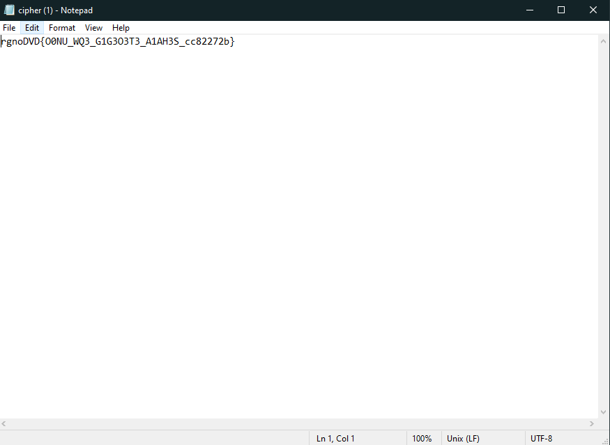
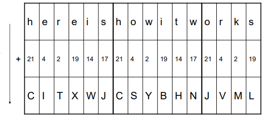

# Vigenere

The link for the challenge: https://play.picoctf.org/practice/challenge/316?category=2&difficulty=2&page=1

Start the challenge 

We get a text file with: 

 

In the challenge description we also get the key: "CYLAB"

recall how vigenere works:

## Vigenere

encrypts text by shifting each letter of the plaintext using a corresponding letter from a repeating keyword

for example: with the key "vector"

So we write a small python script to help us (file included).

The flag is: picoctf{d0nt_us3_v1g3n3r3_c1ph3r_ae82272q}
