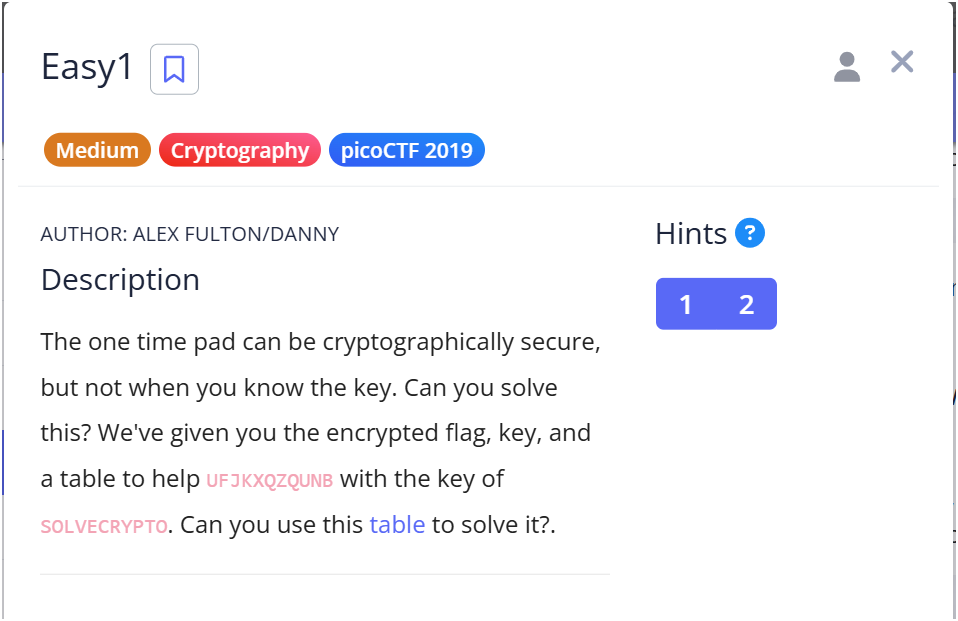

# 🧩 PicoCTF 2024 - Challenge Writeup: Easy1

**By**: Yaek Hubara

---

## 📝 Description

[Challenge link](https://play.picoctf.org/practice/challenge/43?category=2&difficulty=2&page=3)



> The one time pad can be cryptographically secure, but not when you know the key.  
> Can you solve this?  
>  
> We've given you the encrypted flag, key, and a table to help:  
> Encrypted flag: `UFJKXQZQUNB`  
> Key: `SOLVECRYPTO`  
> Can you use this table to solve it?

---

## 🔓 Solution

הצופן כאן הוא **Vigenère Cipher** – שיטה להצפנה סימטרית שמשתמשת במפתח חוזר כדי להזיז כל אות במסר המוצפן לפי ערך תו במפתח.

הטבלה שניתנה עם האתגר היא טבלת Vigenère קלאסית, אך נשתמש בקוד Python כדי לבצע את הפענוח בצורה מדויקת ואוטומטית.

### ✅ Python Decryption Code

```python
def vigenere_decrypt(ciphertext, key):
    alphabet = "ABCDEFGHIJKLMNOPQRSTUVWXYZ"
    plaintext = ""

    ciphertext = ciphertext.upper()
    key = key.upper()
    key_length = len(key)

    for i, char in enumerate(ciphertext):
        if char in alphabet:
            c_index = alphabet.index(char)
            k_index = alphabet.index(key[i % key_length])
            p_index = (c_index - k_index) % 26
            plaintext += alphabet[p_index]
        else:
            plaintext += char  # לא משנים תווים שאינם אותיות

    return plaintext


ciphertext = "UFJKXQZQUNB"
key = "SOLVECRYPTO"

decrypted = vigenere_decrypt(ciphertext, key)
flag = f"picoCTF{{{decrypted}}}"

print("Decrypted flag:", flag)
