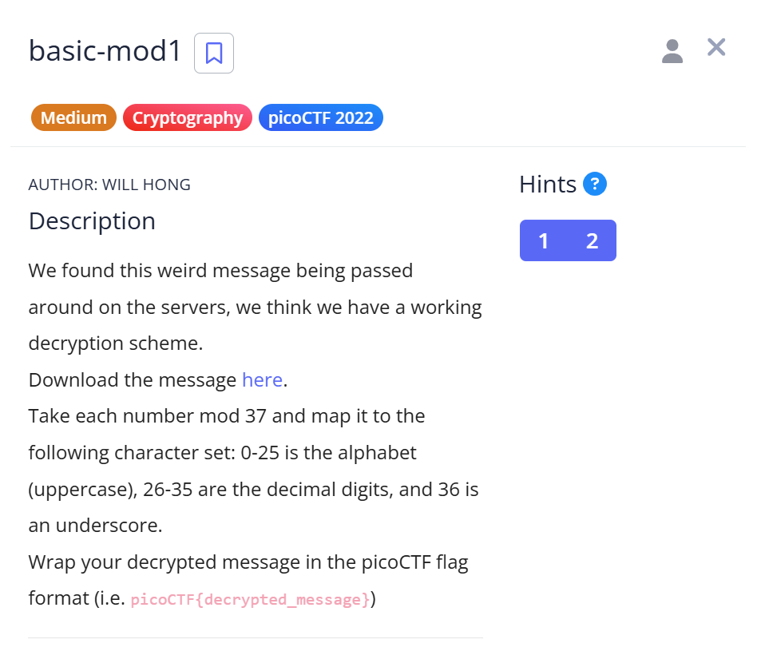

# basic-mod1

**By**: Yael Hubara

## Description

[Challenge link](https://play.picoctf.org/practice/challenge/253?category=2&difficulty=2&page=2)



We found this weird message being passed around on the servers, we think we have a working decryption scheme.
Download the message here.
Take each number mod 37 and map it to the following character set: 0-25 is the alphabet (uppercase), 26-35 are the decimal digits, and 36 is an underscore.
Wrap your decrypted message in the picoCTF flag format (i.e. picoCTF{decrypted_message})

---

## Solution

### Input Numbers

```
[350, 63, 353, 198, 114, 369, 346, 184, 202, 322, 94, 235, 114, 110, 185, 188, 225, 212, 366, 374, 261, 213]
```

### Python Code

```python
# הנתונים שהתקבלו
numbers = [350, 63, 353, 198, 114, 369, 346, 184, 202, 322, 94, 235, 114, 110, 185, 188, 225, 212, 366, 374, 261, 213]

def map_number_to_char(num):
    mod = num % 37
    if 0 <= mod <= 25:
        return chr(mod + ord('A'))
    elif 26 <= mod <= 35:
        return chr(mod - 26 + ord('0'))
    elif mod == 36:
        return '_'
    else:
        return '?'

# פענוח ההודעה
decrypted_chars = [map_number_to_char(num) for num in numbers]
decrypted_message = ''.join(decrypted_chars)
flag = f"picoCTF{{{decrypted_message}}}"

print("Decrypted message:")
print(flag)
```

### Output

```
Decrypted message:
picoCTF{R0UND_N_R0UND_ADD17EC2}
```

### Final Flag

```
picoCTF{R0UND_N_R0UND_ADD17EC2}
```

---


