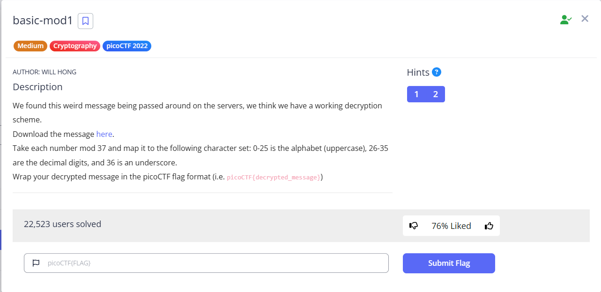
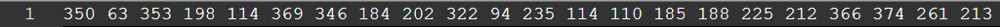

# basic-mod1

This is the write-up for the "basic-mod1" challenge from picoCTF.

---

# The challenge

## Description

We found this weird message being passed around on the servers, we think we have a working decryption scheme.
Download the message here.
Take each number mod 37 and map it to the following character set: 0-25 is the alphabet (uppercase), 26-35 are the decimal digits, and 36 is an underscore.
Wrap your decrypted message in the picoCTF flag format (i.e. picoCTF{decrypted_message})



---

## Initial look

When you start the challenge, you'll be provided with a list of numbers. The numbers are encrypted, and your goal is to decrypt them. Here is the message you are given:



---

# How to solve it

Each of these numbers needs to be decrypted using a modulo operation and a mapping system. You'll apply mod 37 to each number, then map the result to a character set. The result will form the decrypted message.

| Original Number | mod 37 |
| --------------- | ------ |
| 350             | 17     |
| 63              | 26     |
| 353             | 20     |
| 198             | 13     |
| 114             | 3      |
| 369             | 36     |
| 346             | 13     |
| 184             | 36     |
| 202             | 17     |
| 322             | 26     |
| 94              | 20     |
| 235             | 13     |
| 114             | 3      |
| 110             | 36     |
| 185             | 0      |
| 188             | 3      |
| 225             | 3      |
| 212             | 27     |
| 366             | 33     |
| 374             | 4      |
| 261             | 2      |
| 213             | 28     |

Map the Resulting Numbers to Characters:

After applying the modulo operation, map the resulting values to the following character set:

0-25: Maps to uppercase A-Z.

26-35: Maps to digits 0-9.

36: Maps to an underscore (_).

| mod 37 | Character |
| ------ | --------- |
| 17     | R         |
| 26     | 0         |
| 20     | U         |
| 13     | N         |
| 3      | D         |
| 36     | \_        |
| 13     | N         |
| 36     | \_        |
| 17     | R         |
| 26     | 0         |
| 20     | U         |
| 13     | N         |
| 3      | D         |
| 36     | \_        |
| 0      | A         |
| 3      | D         |
| 3      | D         |
| 27     | 1         |
| 33     | 7         |
| 4      | E         |
| 2      | C         |
| 28     | 2         |


Using the above mapping, you get the decrypted message: R0UND_N_R0UND_ADD17EC2


---

## The flag

```
picoCTF{R0UND_N_R0UND_ADD17EC2}
```
Done!
