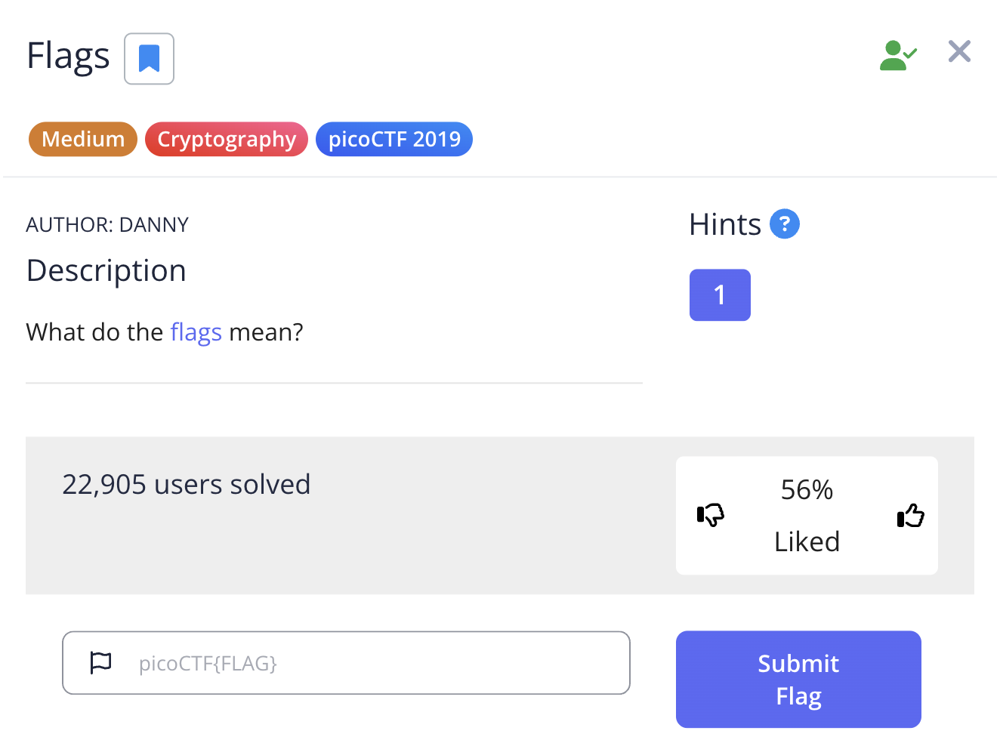
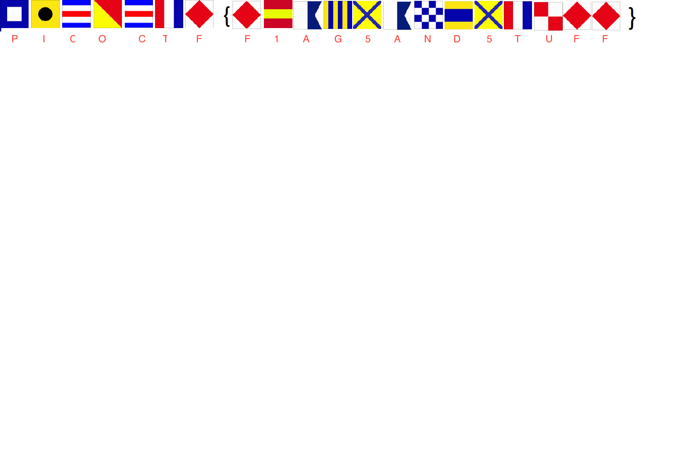
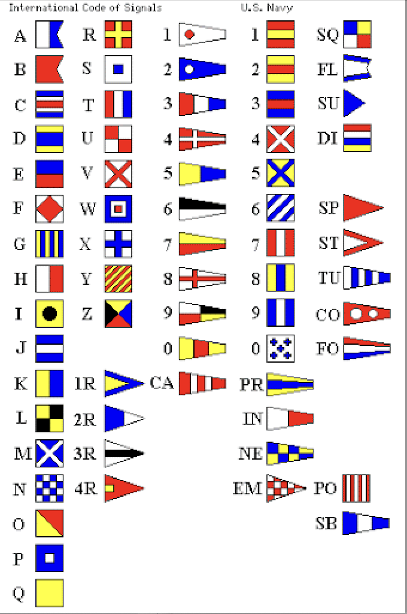
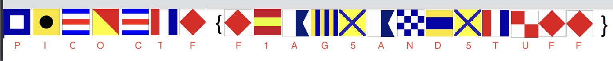

The link of the challenge: https://play.picoctf.org/practice/challenge/31?category=2&difficulty=2&page=3

Go to the link and you should see this:

Click on the "Flags" and download the file **flag.png**  
thats whats inside:

Search on Google's website and look for these flags decryption on Google Images:

Attach each letter/number into each flag and you'll get the encrypted flag:

Now you have the complete flag!

:trophy: the challenge is **solved**.  

#### The flag is: picoCTF{F1AG5AND5TUFF}
