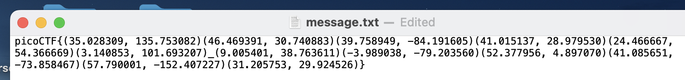
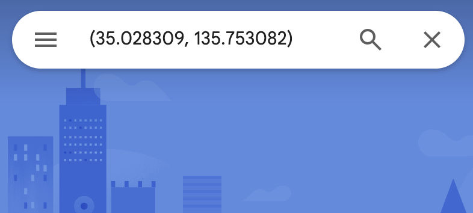
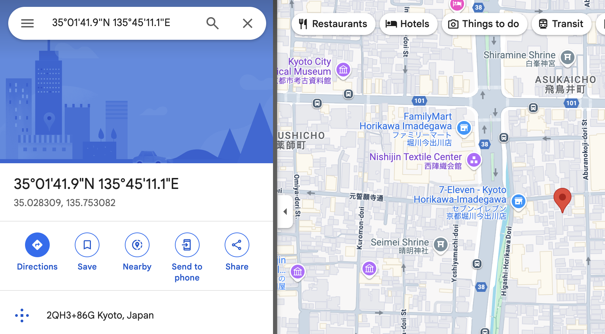
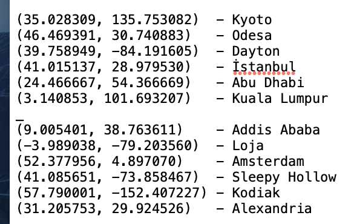

The link of the challenge: https://play.picoctf.org/practice/challenge/40?category=2&difficulty=2&page=3

Go to the link and you should see this:

Click on the "message" link and download the file **message.txt**  
thats whats inside:

Copy the coordinates into Google Maps:

Each coordinates couple will bring you to a different place on earth.  
Copy the city name where the marker is located on the map:

Write the city name connected to each coordinate.  
the flag is constructed from the first letter of each city.  
so you got "KODIAK ALASKA"  

Now you have the complete flag!

:trophy: the challenge is **solved**.  

#### The flag is: picoCTF{KODIAK_ALASKA}
