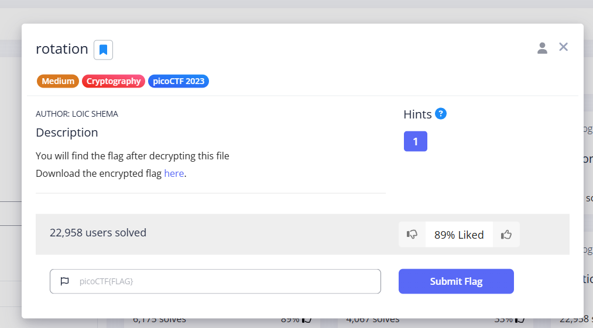
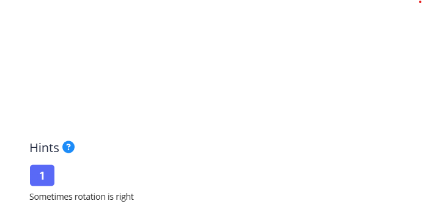
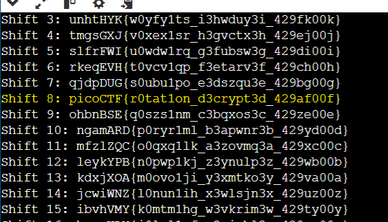

# rotation
These are the steps to solve the rotation hint.

## The challenge

# description
The link of the challenge: https://play.picoctf.org/practice/challenge/373?category=2&difficulty=2&page=1

Go into the link.

You should see this page: 

  

Clicking the hint will reveal it:

  

Click the link to receive an encrypted text file
You should see this: 

 

## How to solve it
The hint "Sometimes rotation is right" refers to:
Using a Caesar cipher encryption a method where each letter is shifted a certain number of steps forward in the alphabet.
The word "rotation" directly indicates the shifting or "rotating" of the letters.
The word "right" suggests moving forward in the alphabet.

Therefore we will try to decrypt the text using a Caesar cipher.

In the Caesar cipher we first choose a "key" an integer between 0 and 25. 
This key represents the number of positions each letter in the message will be shifted.
Therefore To decrypt the ciphertext and reveal the original message we perform the reverse operation, 
each letter in the encrypted text is shifted backward by the same key value.
Since there are only 26 possible keys we can try every possible shift. 
We can build a small Python script to iterate through all 26 possibilities and by running it on the ciphertext 
we can identify the original message.

After running the program we will get:

We obtained the flag after 8 shifts
the challenge is solved.

The flag is: picoCTF{r0tat1on_d3crypt3d_429af00f}