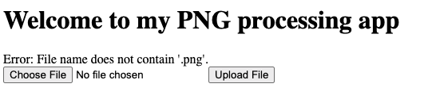

# TRICKSTER
This is the write-up for the challenge "Trickster" challenge in PicoCTF

# The Challange
## Description
I found a web app that can help process images: PNG images only! http://atlas.picoctf.net:63035/
## Hints
(none)

## Initial look
The page is titled as a PNG processing app, with a **“Choose File”** and **“Upload File”** button.
Uploading a valid `.png` file works as expected.  
I guessed uploaded files were served from: http://atlas.picoctf.net:63035/uploads/filename
 
# How to solve it

I tried to upload a blank file and recieved : 
> "Error: File name does not contain '.png'."

This suggested that the site checks only for `.png` in the filename.

Uploading a renamed JPEG (`a .png file.jpeg`) produced:
> "Error: The file is not a valid PNG image: ffd8ffe0"

This revealed a **file signature (magic bytes)** check was in place too.

## Bypassing the checks
The goal was to trick the server into accepting a file that could **execute code**, a **PHP webshell**.

1. The upload filter accepts files if the name **contains `.png`**
2. The file must pass a **PNG magic byte check**
3. 3. I created a webshell and saved it as: `webshell.png.php`

This passed the filters and was **executed as PHP** on the server.

Accessing: http://atlas.picoctf.net:63035/uploads/webshell.png.php brought up the working shell:

Running `ls -a /` Revealed a /challenge directory, but access was denied.
However, exploring: `ls -a /var/www/html` I discovered a suspiciously named file:

Using `cat /var/www/html/MQZ*` I retrieved the flag:
# 🎉 Flag
**picoCTF{c3rt!fi3d_Xp3rt_tr1ckst3r_d3ac625b}**

