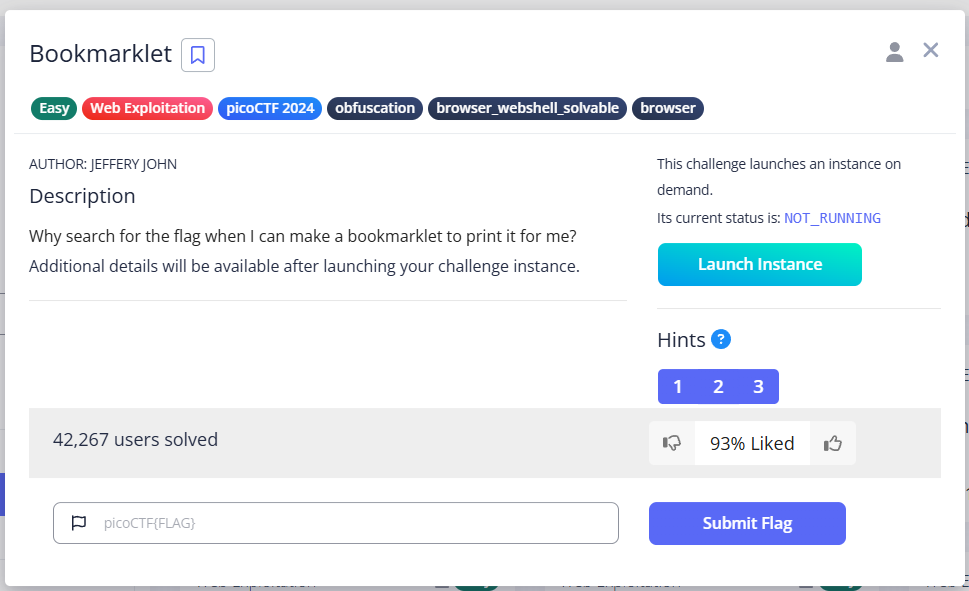
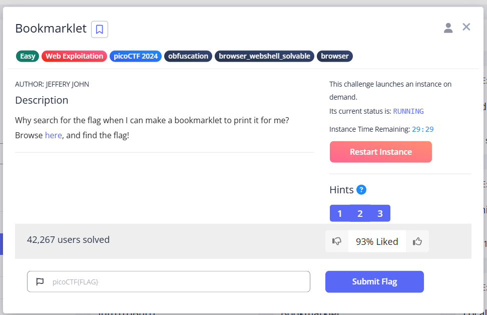
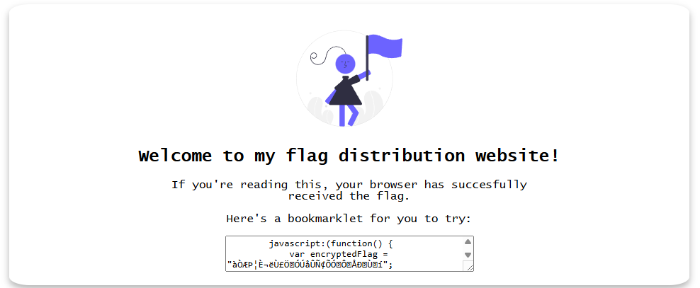
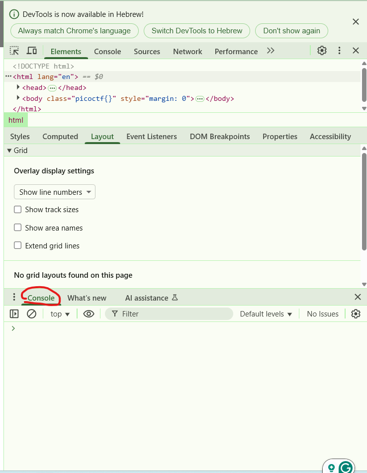
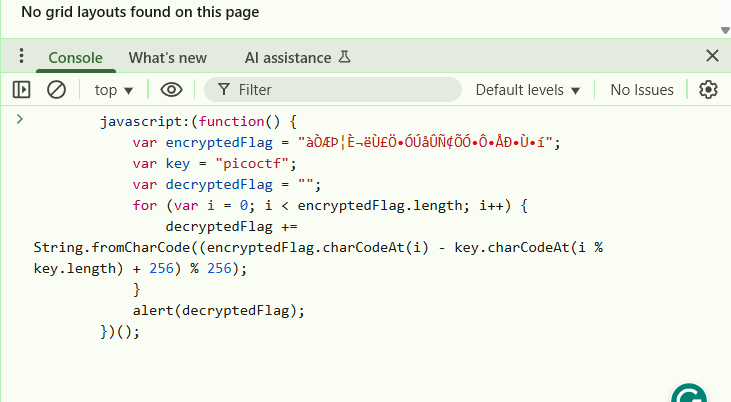
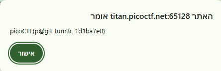

# Bookmarklet
These are the steps to solve the Bookmarklet puzzle.

## The challenge

# description
The link of the challenge: https://play.picoctf.org/practice/challenge/406?category=1&difficulty=1&page=1

Go into the link.

You should see this page: 

  

Now click on the Launch Instance button.

You should see a screen like this (note that Launch Instance has become 
Restart Instance):

  

Go to the link inside.

You should see this: 

 

## How to solve it
# steps
1.Click the right mouse button and select the "Inspect" option.

2.Go to the Console tab – this is where you can run live JavaScript directly on the page.

3.Copy all the code you received and paste it into the Console and press Enter.

# the solution
The code will display a message containing the flag.

the challenge is solved.

The flag is: picoCTF{p@g3_turn3r_1d1ba7e0}