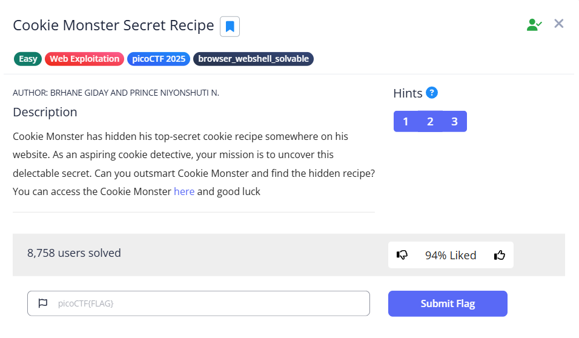
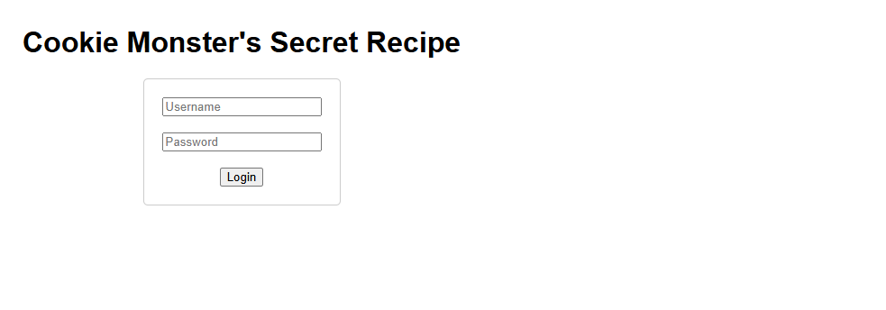
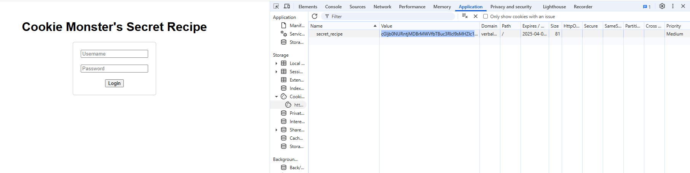

The link of the challenge: https://play.picoctf.org/practice/challenge/469?category=1&page=1  
Go into the link.  
You should see this page:  
  
Go to the link inside.  
You should see this:  
  
Open inspect and open the cookies:  
  
Now you have the value in base64.  
You just need to decode it.

the challenge is solved.  
The flag is: picoCTF{c00k1e_m0nster_l0ves_c00kies_6C2FB7F3}
