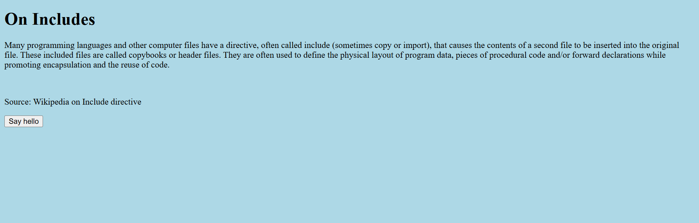
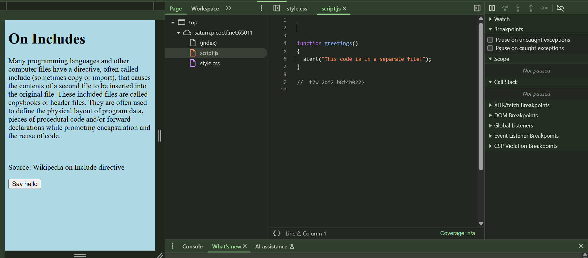

# Includes

This is the write-up for the "Includes" challenge from picoCTF.

---

# The challenge

## Description

https://play.picoctf.org/practice/challenge/274?category=1&page=1


---

## Initial look

When you open the link, you’re greeted with a simple txt page Click on Launch Instance, and then a link to the website will appear.


When you click on the website link, it opens a new window and displays a new page.





There’s nothing obviously visible on the page. So I opened the **Developer Tools** by pressing `F12` in Chrome and looked at the **Elements tab**.

I noticed a link to a stylesheet file called `styles.css`.


Inside the CSS file, I found this comment:

```
/*  picoCTF{1nclu51v17y_1of2_  */

```

Interesting — looks like part of a flag.

Then I saw that a JavaScript file was also included:

```
function greetings()
{
  alert("This code is in a separate file!");
}
```

So I visited:


And found the second part:

```
//  f7w_2of2_b8f4b022}

```



---

# How to solve it

The flag was split across two files: one part in the CSS file and the other in the JavaScript file.

I combined both parts to form the final flag.


---

## The flag

```
picoCTF{1nclu51v17y_1of2_f7w_2of2_b8f4b022}

```
Done!
