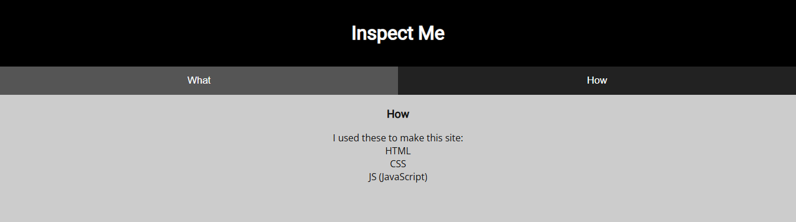
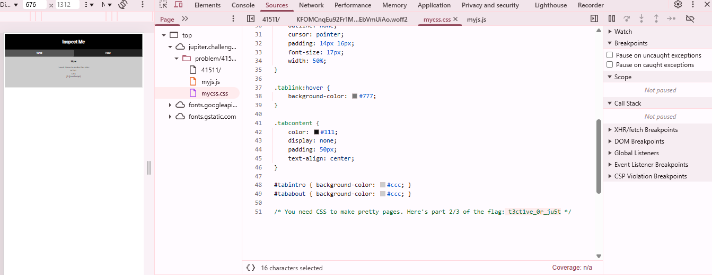
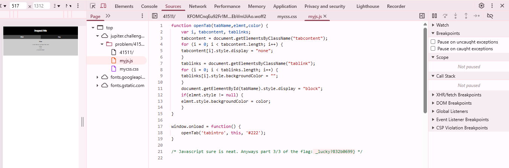

# Insp3ct0r

This is the write-up for the "Insp3ct0r" from the Web Exploitation section of picoCTF.

## The Challenge

**Original Description:**

Kishor Balan tipped us off that the following code may need inspection:
https://jupiter.challenges.picoctf.org/problem/41511/
or http://jupiter.challenges.picoctf.org:41511

**Category:** Web Exploitation
**Difficulty:** Easy 

## Hints

1. How do you inspect web code on a browser?
2. There's 3 parts

When we open the link, we see this:

If we click on the section that says **"how"**, we see this:

We open the browser inspector. Inside the **"how"** section, it shows three files: `html`, `css`, and `javascript`.

We start by checking the HTML file, and we see this:

Here we find the **first part of the flag**. According to the challenge hints, the flag is divided into **three parts**, and this confirms that this is the first one.

Next, we look at the CSS file, and we find this:

This contains the **second part of the flag**.

Then, in the JavaScript file, we find this:

This is the **final part of the flag**.

## Solution

**Flag:**  
picoCTF{tru3_d3t3ct1ve_0r_ju5t_lucky?832b0699}
