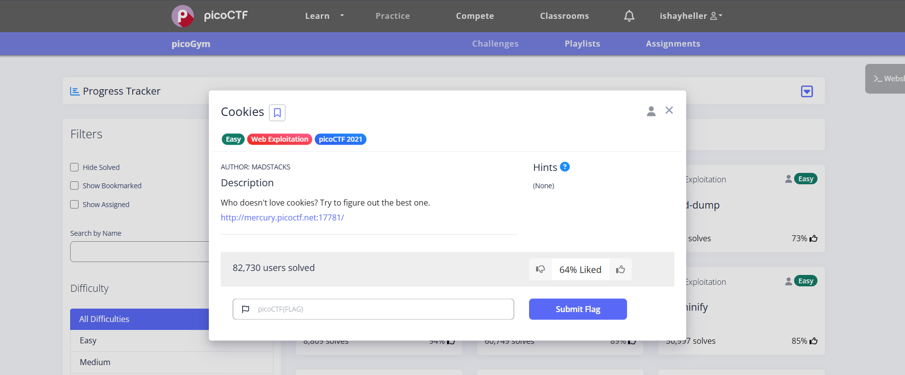
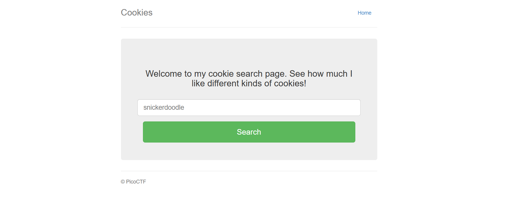
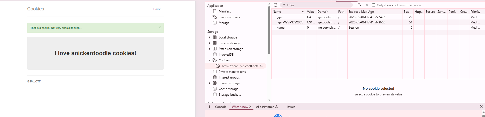
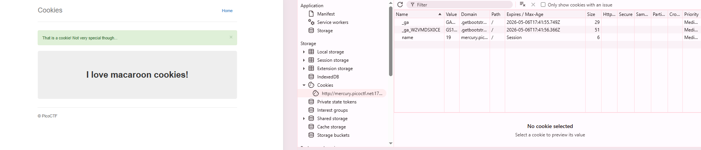
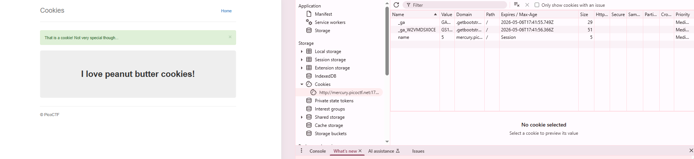
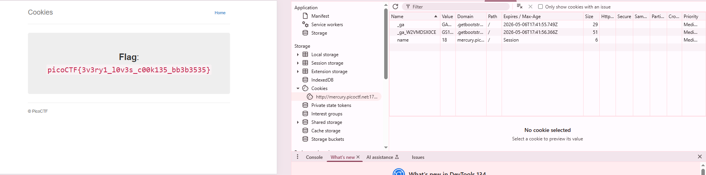
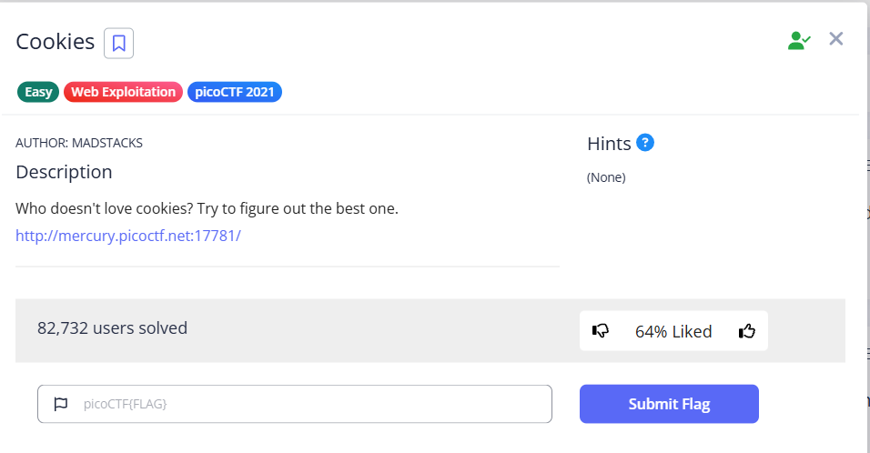

# Cookies Challenge

**The link of the challenge:**  
https://play.picoctf.org/practice/challenge/173?category=1&page=1

---

### Step 1: Access the Challenge
Go into the link and you should see this page:  

---

### Step 2: Visit the Website
Go to the link provided in the challenge description (http://mercury.picoctf.net:17781/). You should see this landing page:  

---

### Step 3: Search for "snickerdoodle"
1. Type "snickerdoodle" in the search box and press Enter
2. Observe the response in the browser's **Application** tab under Cookies

---

### Step 4: Explore Cookies
1. Open the **browser inspector** (F12 or Right-Click → Inspect).
2. Go to the **Application** tab → **Cookies** section.  
   You'll see different cookies stored:  
   

---

### Step 5: Change Cookie Values
1. Notice the cookie named `name` with value `0`.  
   
2. Modify its value to `1` and refresh the page. The page content changes!
3. Keep testing different values (e.g., `2`, `3`, etc.) until you find the flag.

---

### Step 6: Find the Flag
When you set the cookie `name` to a specific value (e.g., `18`), the flag will appear:  

---

### :trophy: Challenge Solved!
**The flag is:**  
`picoCTF{3v3ry1_l0v3s_c00k135_bb38555}`

---
