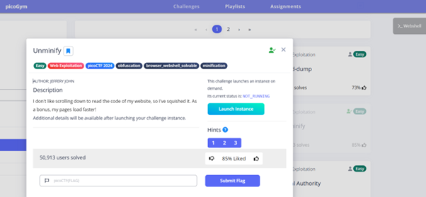
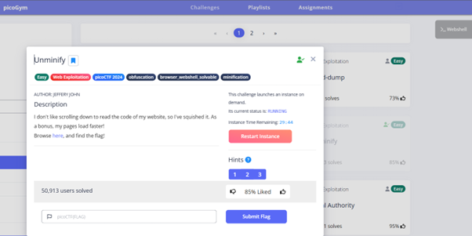
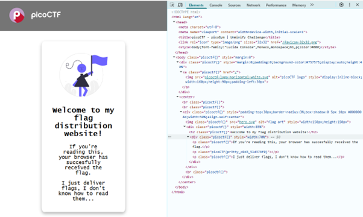
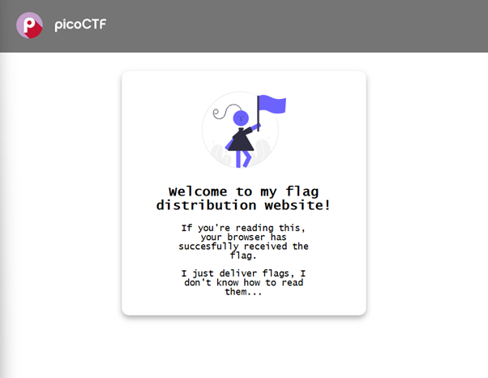

The link of the challenge: https://play.picoctf.org/practice/challenge/426?category=1&difficulty=1&page=1
Go into the link.
You should see this page:
  
 
Launch Instance:
   
 
Go to the link inside.
You should see this:
   
 
Open inspect and open the full script:
  
 
Find the flag blew the text “If you're reading this, your browser has succesfully received the flag.” In the inspect.
the challenge is solved.
The flag is: picoCTF{pr3tty_c0d3_51d374f0}

