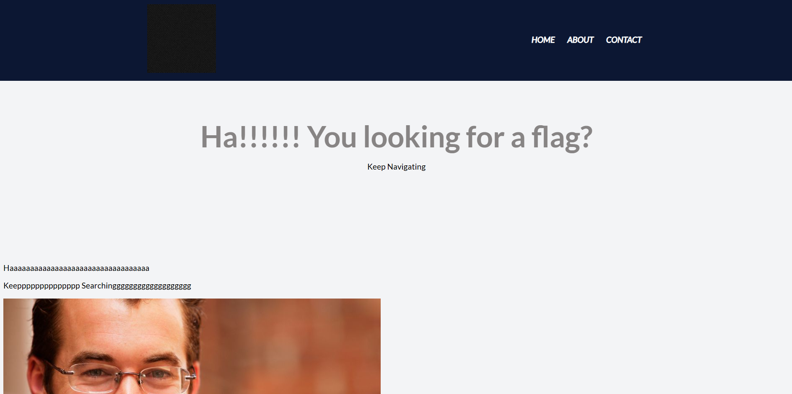
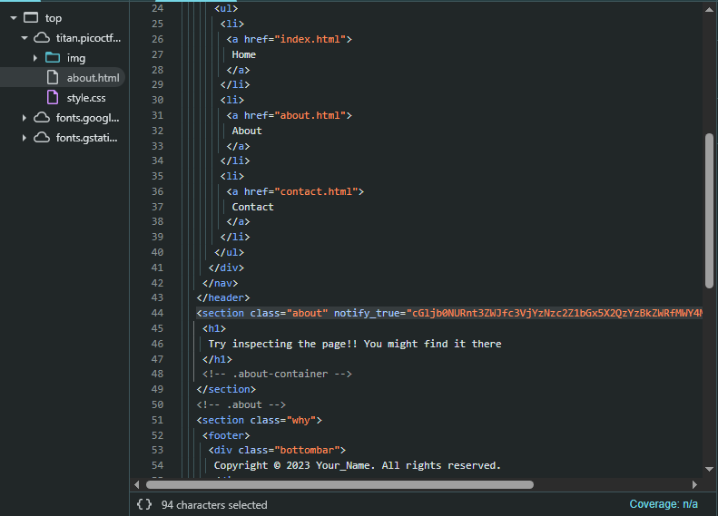

The link of the challenge: https://play.picoctf.org/practice/challenge/427?category=1&difficulty=1&originalEvent=73&page=1&solved=0 

Start the challenge 

You will land on this page:  
 
 
After careful examination of the html files for: Home, About and Contact
we can find this suspicious html code:  

on a closer look we can notice this string is our 64base encoded flag
cGljb0NURnt3ZWJfc3VjYzNzc2Z1bGx5X2QzYzBkZWRfMWY4MzI2MTV9
The flag is: picoCTF{web_succ3ssfully_d3c0ded_1f832615}