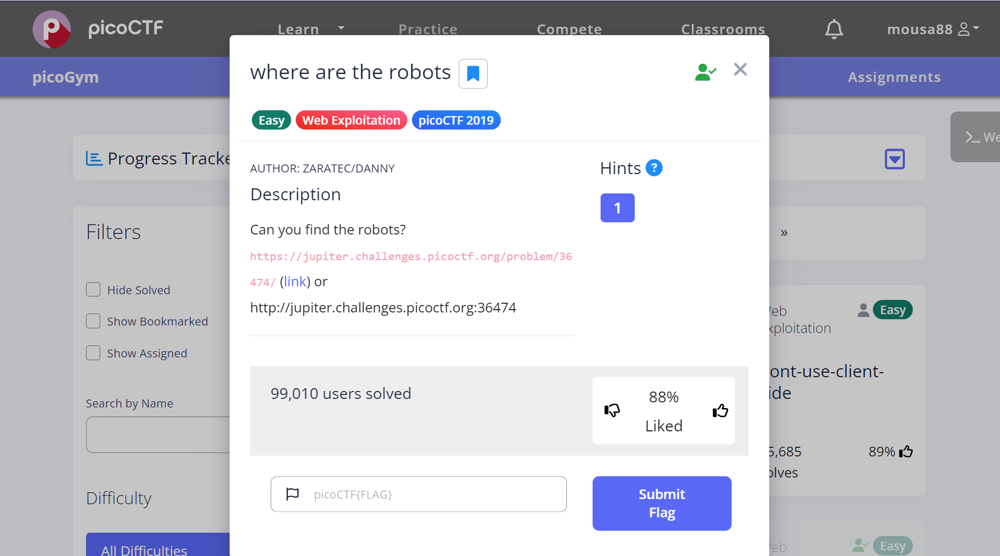
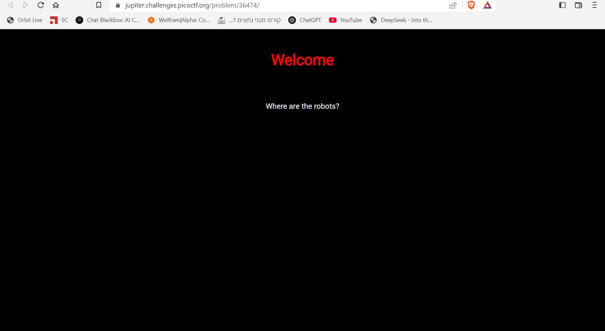
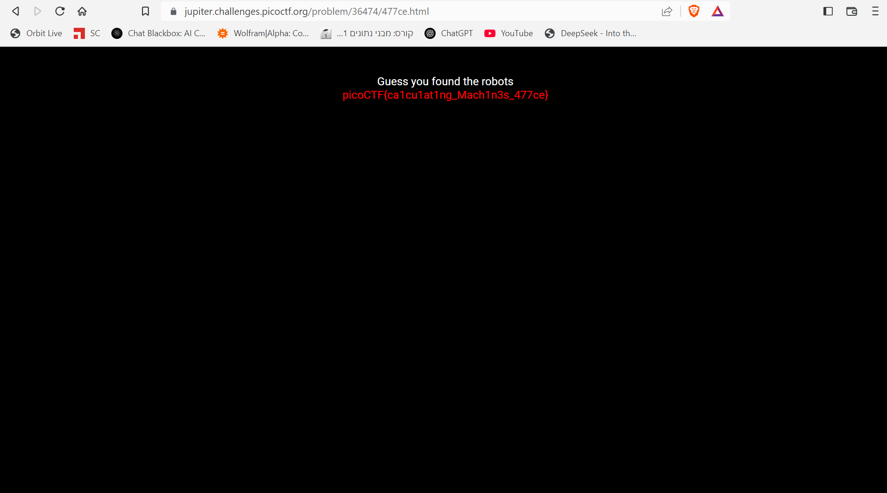

The link of the challenge: https://play.picoctf.org/practice/challenge/4?category=1&page=2  
Go into the link.  
You should see this page:  
  
Go to the link inside.  
You should see this:  
  
type in the url /robots.txt:  
  
Now you have to type in the url /477ce.html .  

the challenge is solved.  
The flag is: picoCTF{ca1cu1at1ng_Mach1n3s_477ce}
