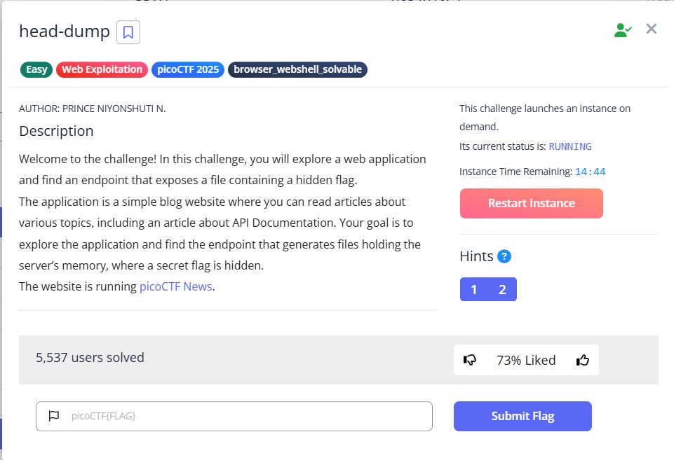
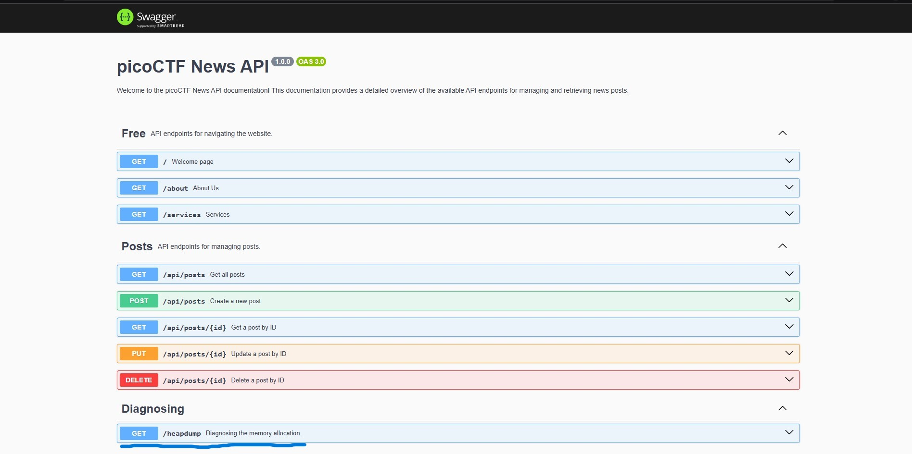
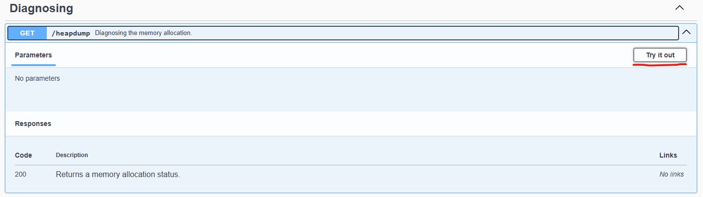
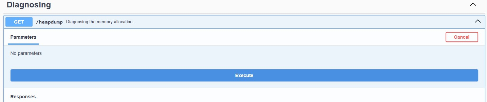
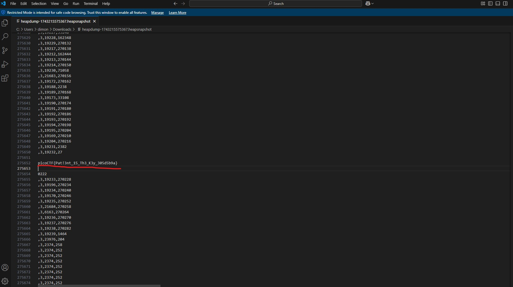

# head-dump challenge
This is the write-up for the challenge "head-dump" challenge in PicoCTF
link for the challenge: https://play.picoctf.org/practice/challenge/476

# The challenge
## Description
In this challenge your target is to explore an blog like website and search its end-points through API to find a way to get
The servers memory file which includes the key for the solution.

# Solution steps
## 1. 
 - Visit the challenge website and start it:
   ### 

## 2.
 - We are starting on the blog website page, upon looking at the elements we can see there is a 
   link for the websites API documentation which we will look at:
   ### 
  
## 3.
 - On the API's page we can see many different methods that the website uses. if we look carefully we can see an interesting get method called heapdump in the Diagnosing section:
   ### 
  
## 4.
 - We can see in the description that this method returns a memory allocation status, that might be our solution, click on the try it out button:
   ### 
  
## 5.
 - Now we can see the website offers us an execute button which we will inspect:
   ### 
  
## 6.
 - We got some hidden api link for a get method which gives us a server file, we can download it straigth from the website using the Download button or visit the API link:
   ### 
  
## 7.
 - we got the server file which we can open in any text editor and look for whatever we need, in this case lets try to look for anything related to Pico for our solution and indeed the key is there we have found it:
   ### 

# Challenge solution key:
## picoCTF{Pat!3nt_15_Th3_K3y_305d5b9a}

### Challenge is solved, good job!
