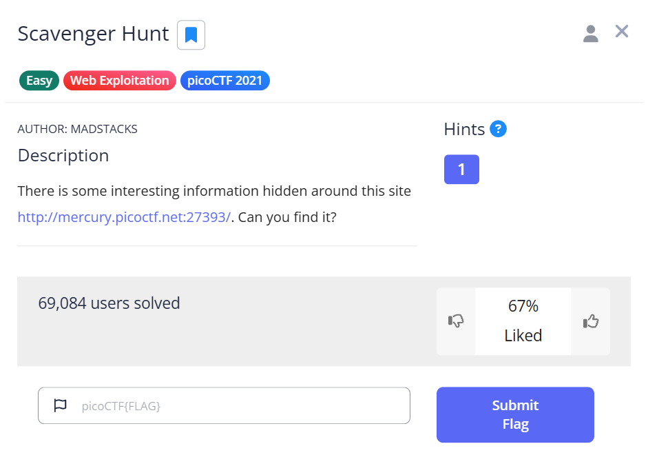
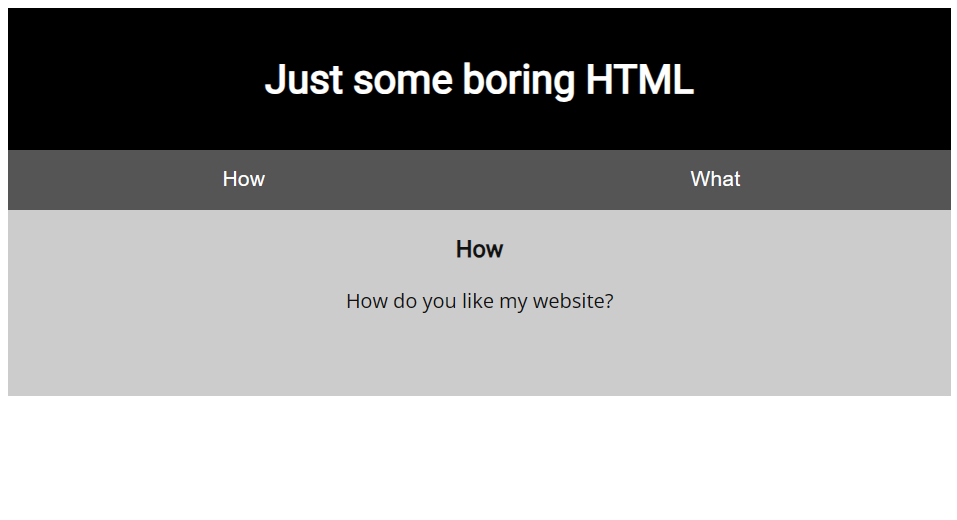
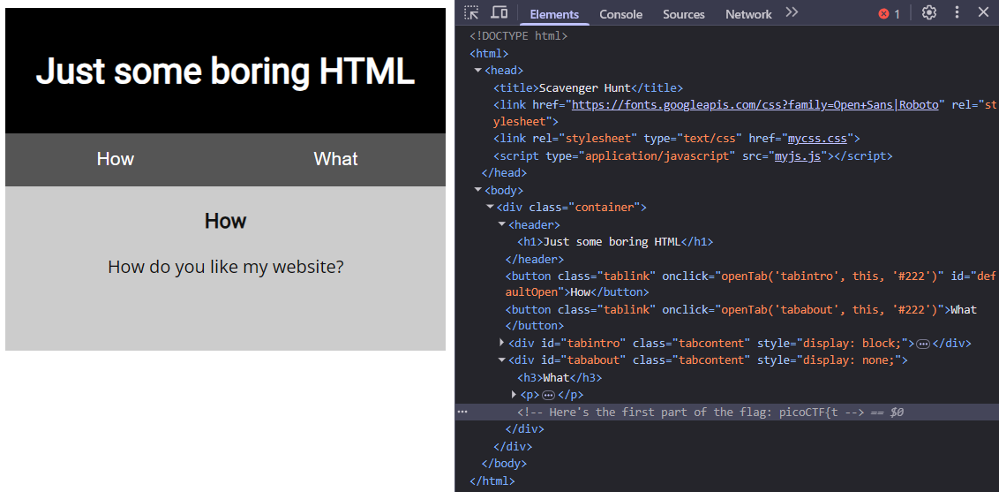
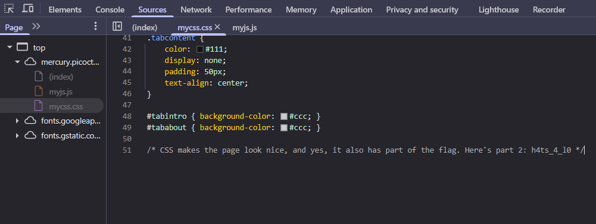
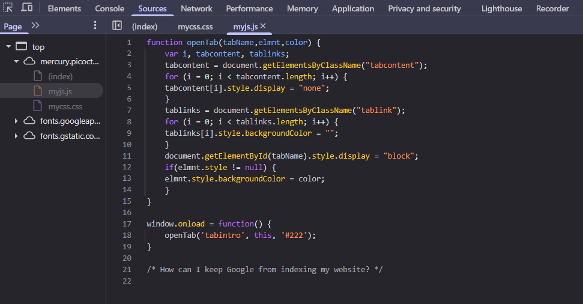
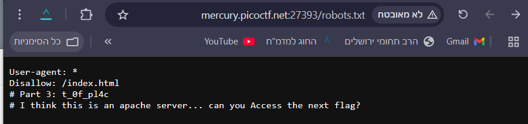
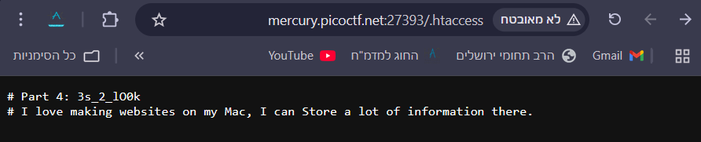
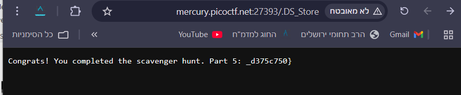
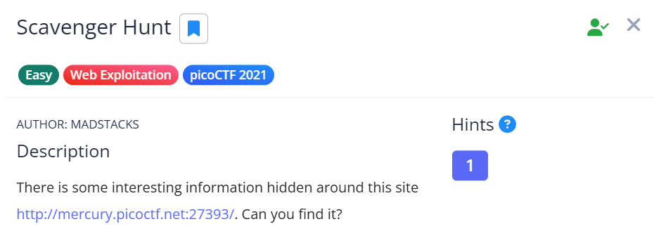

The link of the challenge: https://play.picoctf.org/practice/challenge/161?category=1&difficulty=1&page=2 
Go into the link.  
You should see this page:  
  
Go to the link inside.  
You should see this:  
  
Open inspector and look inside index.html file at all the html elements to find the 1st part of the flag:  
  
Go to "Sources" tab in the inspector and inspect the "mycss.css" file to find the 2nd part of the flag:

Inspect the "myjs.js" file to find a hint for the third part of the flag:

By searching the web to figure out how to keep Google from indexing a website, i understood that in order to do that i should use a Robots. for that there must be a robots.txt file.
Go to address/robots.txt route to find the 3rd part of the flag and a hint for the 4th part.

the hint tells me the website is using an apache server, therefore it has a ".htaccess" configuration file.
Go to address/.htaccess route to find the 4th part of the flag and a hint for the last part.

the hint tells me there is some connection to mac specific type file.
Go to address/.DS_store route to find the last part of the flag.

Now you have the complete flag!

the challenge is solved.  

The flag is: picoCTF{th4ts_4_l0t_0f_pl4c3s_2_lO0k_d375c750}
